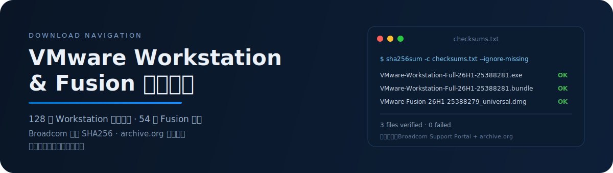

#  VMware Workstation & Fusion 下载中心

   [](./LICENSE) [](https://www.broadcom.com/company/legal/licensing)

<p align="center">
  
</p>

> **一站式 VMware Workstation Pro & Fusion Pro 免费下载导航**

<sub>_数据抓取时间：2026-07-06 03:42 UTC_</sub>

---

## 目录

- [快速下载（最新版）](#-快速下载最新版)
- [校验完整性](#-校验完整性)
- [Linux 安装 `.bundle`](#-linux-安装-bundle)
- [所有历史版本](#-所有历史版本)
- [免费使用政策](#-免费使用政策)
- [老系统兼容性](#️-老系统兼容性)
- [数据来源与说明](#-数据来源与说明)
- [贡献与反馈](#贡献与反馈)
- [License](#-license)

## 🚀 快速下载（最新版）

> 直接点击文件名下载，无需登录。哈希在下方，下载后请务必[校验完整性](#-校验完整性)。

### 🪟 VMware Workstation Pro

**26H1** · Build `25388281` · 发布于 **2026-05-14**

- **Windows** — [VMware-Workstation-Full-26H1-25388281.exe](https://archive.org/download/vmwareworkstationarchive/26H1/VMware-Workstation-Full-26H1-25388281.exe) (274.34 MB · SHA256 `a0ef9087607d9cad…`)
- **Linux** — [VMware-Workstation-Full-26H1-25388281.x86_64.bundle](https://archive.org/download/vmwareworkstationarchive/Linux/26H1/VMware-Workstation-Full-26H1-25388281.x86_64.bundle) (325.03 MB · SHA256 `3f6d2501e654dbc7…`)

### 🍎 VMware Fusion Pro

**26H1** · Build `25388279` · 发布于 **2026-05-14**

- **macOS** — [VMware-Fusion-26H1-25388279_universal.dmg](https://archive.org/download/vmwareworkstationarchive/Fusion/26H1/VMware-Fusion-26H1-25388279_universal.dmg) (480.71 MB · SHA256 `c1d373aa21be2567…`)

## 🔐 校验完整性

所有哈希由 **Broadcom Support Portal（主线版）** + **archive.org 官方元数据（历史版）** 导出，保存在：

- 📄 [`data/checksums.txt`](data/checksums.txt) — **SHA256** 清单，喂给 `sha256sum -c` / `shasum -a 256 -c`
- 📄 [`data/checksums.sha1.txt`](data/checksums.sha1.txt) — **SHA1** 兜底清单（archive.org 历史版本无 sha256，喂给 `sha1sum -c` / `shasum -a 1 -c`）
- 📄 [`data/vmware_downloads.json`](data/vmware_downloads.json) — 完整元数据 (size / SHA256 / SHA1 / MD5 / build)

> **为什么有 SHA1？** Broadcom 收购 VMware 后下架了老版本 support 页面，官网 SHA256 只保留当前主线版本。archive.org 镜像了历史包但其元数据只提供 SHA1/MD5。SHA1 密码学强度虽弱于 SHA256，但用于**校验下载完整性**（防传输损坏 & 官方镜像投毒）依然足够。

把 `checksums.txt` 与下载的 `.exe`/`.bundle`/`.dmg` **放在同一目录**：

<details open>
<summary><b>🐧 Linux / 🍎 macOS</b></summary>

```bash
# Linux（GNU coreutils）
sha256sum -c checksums.txt --ignore-missing

# macOS（系统自带 shasum）
shasum -a 256 -c checksums.txt --ignore-missing
```

</details>

<details>
<summary><b>🪟 Windows PowerShell</b></summary>

```powershell
Get-Content checksums.txt | ForEach-Object {
    $h, $f = $_ -split '  ', 2
    if (-not (Test-Path $f)) { return }
    $actual = (Get-FileHash $f).Hash.ToLower()
    $ok = $actual -eq $h.ToLower()
    '{0}  {1}' -f $(if ($ok) {'OK  '} else {'FAIL'}), $f
}
```

</details>

**期望输出**：

```
VMware-workstation-full-17.6.4-24832109.exe: OK
```

> ✅ 看到 `OK` 就是**逐字节校验通过**，可以放心安装。
> ❌ 看到 `FAILED` / `WARNING` 一律**别装**，重新下载。

> 💡 `--ignore-missing` 让工具只校验当前目录已有的文件，不必下齐全部。

## 🐧 Linux 安装 `.bundle`

VMware 官方 Linux 安装包是自解压 shell 脚本（`.bundle`），不是 rpm/deb。安装、卸载都用同一个二进制。

### 前置：内核头文件

VMware 会在安装过程中编译 `vmmon` / `vmnet` 两个内核模块。必须先装匹配当前内核的 header：

<details open>
<summary><b>Debian / Ubuntu</b></summary>

```bash
sudo apt update
sudo apt install -y build-essential linux-headers-$(uname -r)
```

</details>

<details>
<summary><b>Fedora / RHEL / Rocky / AlmaLinux</b></summary>

```bash
sudo dnf install -y gcc make kernel-devel kernel-headers
# kernel-devel 会拉取匹配运行内核的版本; 若内核刚升级过, 先 reboot 再装
```

</details>

<details>
<summary><b>Arch / Manjaro</b></summary>

```bash
sudo pacman -S --needed base-devel linux-headers
# 若用 linux-lts 内核，装 linux-lts-headers
```

</details>

<details>
<summary><b>openSUSE / SLES</b></summary>

```bash
sudo zypper install -y kernel-syms gcc make
# kernel-syms 自动匹配当前内核变体 (default / preempt / ...) 的开发包
```

</details>

### 安装

```bash
# 1. 校验完整性 (先做, 见上一节)
sha256sum -c checksums.txt --ignore-missing

# 2. 加执行权限
chmod +x VMware-Workstation-Full-*.x86_64.bundle

# 3. 运行安装器 (需 root)
sudo ./VMware-Workstation-Full-*.x86_64.bundle

# 或静默安装 (不弹 GUI, 自动接受 EULA)
sudo ./VMware-Workstation-Full-*.x86_64.bundle --console --required --eulas-agreed
```

首次启动 `vmware` 命令时会触发模块编译。如果编译失败（新内核常见），装社区维护的补丁：

```bash
git clone https://github.com/mkubecek/vmware-host-modules.git
cd vmware-host-modules
git checkout workstation-17.6.4  # 换成你装的版本 tag
make
sudo make install
sudo systemctl restart vmware
```

### 卸载

```bash
# 列出已安装组件
vmware-installer -l

# 卸载 Workstation (组件名一般是 vmware-workstation)
sudo vmware-installer -u vmware-workstation
```

### 常见坑

| 现象 | 原因 | 处理 |
|:-----|:-----|:-----|
| `Unable to find kernel headers` | header 版本对不上当前 `uname -r` | 内核刚升级过没重启; 或装 `linux-headers-$(uname -r)` |
| 首次启动卡在 `Compiling modules...` | 新内核 API 不兼容旧 VMware | 装 [mkubecek/vmware-host-modules](https://github.com/mkubecek/vmware-host-modules) 补丁 |
| `SecureBoot` 报错模块签名 | 内核开了 lockdown | 关 SecureBoot, 或用 `mokutil` 给编出的模块签名 |
| Wayland 下窗口异常 | VMware GUI 走 X11 | 命令行 `env GDK_BACKEND=x11 vmware` 启动 |

> 官方安装文档：[VMware · Installing Workstation Pro on Linux](https://docs.vmware.com/en/VMware-Workstation-Pro/17.0/com.vmware.ws.using.doc/GUID-832D3ABB-DE30-4BED-9A36-2E0154F0A2ED.html)

## 📦 所有历史版本

> **图例**：✅ Broadcom 官方数据（SHA256 权威）· 📼 archive.org 历史存档（仅 MD5/SHA1）

<details>
<summary><b>🪟 VMware Workstation Pro（128 版）</b></summary>

| 版本 | Build | 发布日期 | Windows | Linux | SHA256 | 来源 |
|:-----|:------|:---------|:--------|:------|:-------|:---:|
| 26H1 | `25388281` | 2026-05-14 | [下载](https://archive.org/download/vmwareworkstationarchive/26H1/VMware-Workstation-Full-26H1-25388281.exe) (274.34 MB) | [下载](https://archive.org/download/vmwareworkstationarchive/Linux/26H1/VMware-Workstation-Full-26H1-25388281.x86_64.bundle) (325.03 MB) | Win SHA256 `a0ef9087607d9cad…` <details><summary>full</summary><code>a0ef9087607d9cad20b08139e73e41242e044ad5bd8cee141d3bad314586737f</code></details><br>Linux SHA256 `3f6d2501e654dbc7…` <details><summary>full</summary><code>3f6d2501e654dbc7701a8290ff6ffcfba6c5444cd5f35f4933cd08c9499f6d84</code></details> | ✅ |
| 25H2u1 | `25219725` | 2026-02-26 | [下载](https://archive.org/download/vmwareworkstationarchive/25H2/VMware-Workstation-Full-25H2u1-25219725.exe) (278.31 MB) | [下载](https://archive.org/download/vmwareworkstationarchive/Linux/25H2/VMware-Workstation-Full-25H2u1-25219725.x86_64.bundle) (296.22 MB) | Win SHA256 `b592c47756d47c93…` <details><summary>full</summary><code>b592c47756d47c932a3ce2c2b83ad3af1fa23ccc1dd1d3166a51bcc1d2bd58e0</code></details><br>Linux SHA256 `721aa93c4ebcaa51…` <details><summary>full</summary><code>721aa93c4ebcaa51ac6db75ed97c7a4db10aa88110446890db1e40bfafc7566a</code></details> | ✅ |
| 25H2 | `24995812` | 2025-10-14 | [下载](https://archive.org/download/vmwareworkstationarchive/25H2/VMware-Workstation-Full-25H2-24995812.exe) (277.63 MB) | [下载](https://archive.org/download/vmwareworkstationarchive/Linux/25H2/VMware-Workstation-Full-25H2-24995812.x86_64.bundle) (295.19 MB) | Win SHA256 `49ad7c2bbce854ed…` <details><summary>full</summary><code>49ad7c2bbce854ed30ed0702d1af9fc042697777dc981e087bfa7241045b0361</code></details><br>Linux SHA256 `9beced8a0653c938…` <details><summary>full</summary><code>9beced8a0653c9382e9aa9917168a54bf5635e566c8cb341589d72cf14093322</code></details> | ✅ |
| 17.6.4 | `24832109` | 2025-07-15 | [下载](https://archive.org/download/vmwareworkstationarchive/17.x/VMware-workstation-full-17.6.4-24832109.exe) (405.72 MB) | [下载](https://archive.org/download/vmwareworkstationarchive/Linux/17.x/VMware-Workstation-Full-17.6.4-24832109.x86_64.bundle) (339.46 MB) | Win SHA256 `10fe3a36f525d88a…` <details><summary>full</summary><code>10fe3a36f525d88aa133118ab3b5a16b18da88d4aa11b14d74e4164b3fb94ba9</code></details><br>Linux SHA256 `64fbfbaeacc48865…` <details><summary>full</summary><code>64fbfbaeacc48865468114362a2bbaade9110cc9e87bc3bd938396ba7f19a9bd</code></details> | ✅ |
| 17.6.3 | `24583834` | 2025-03-04 | [下载](https://archive.org/download/vmwareworkstationarchive/17.x/VMware-workstation-full-17.6.3-24583834.exe) (401.43 MB) | [下载](https://archive.org/download/vmwareworkstationarchive/Linux/17.x/VMware-Workstation-Full-17.6.3-24583834.x86_64.bundle) (335.21 MB) | Win SHA256 `d7c04b4dd1e6bf55…` <details><summary>full</summary><code>d7c04b4dd1e6bf551693897d4805e99c45198a830c6361d9af8267b40906857b</code></details><br>Linux SHA256 `79575917728ded4c…` <details><summary>full</summary><code>79575917728ded4c6d0b89f4ab6a81be9a773c00eeb68d1d12ac0db125478ee0</code></details> | ✅ |
| 17.6.2 | `24409262` | 2024-12-17 | [下载](https://archive.org/download/vmwareworkstationarchive/17.x/VMware-workstation-full-17.6.2-24409262.exe) (447.93 MB) | [下载](https://archive.org/download/vmwareworkstationarchive/Linux/17.x/VMware-Workstation-Full-17.6.2-24409262.x86_64.bundle) (372.49 MB) | Win SHA256 `5e556b7fc1bd2777…` <details><summary>full</summary><code>5e556b7fc1bd27775143eea930cac68760a1b5dc9b4c089d3fc664cd8439645b</code></details><br>Linux SHA256 `15536dfc5afbbcf4…` <details><summary>full</summary><code>15536dfc5afbbcf42daec10b1d9d1d6da3ca27da478938defc9c558064ff09f7</code></details> | ✅ |
| 17.6.1 | `24319023` | 2024-10-10 | [下载](https://archive.org/download/vmwareworkstationarchive/17.x/VMware-workstation-full-17.6.1-24319023.exe) (447.93 MB) | [下载](https://archive.org/download/vmwareworkstationarchive/Linux/17.x/VMware-Workstation-Full-17.6.1-24319023.x86_64.bundle) (372.46 MB) | Win SHA256 `f95429e395a583eb…` <details><summary>full</summary><code>f95429e395a583eb5ba91f09b040e2f8c53a5e7aa37c4c6bfcaf82115a8d3fa4</code></details><br>Linux SHA256 `7b539aafa8251e7a…` <details><summary>full</summary><code>7b539aafa8251e7af3b49dc12a299b127938ef0355d3de68f616ceac3e59e016</code></details> | ✅ |
| 17.6 | `24238078` | 2024-09-03 | [下载](https://archive.org/download/vmwareworkstationarchive/17.x/VMware-workstation-full-17.6.0-24238078.exe) (447.97 MB) | [下载](https://archive.org/download/vmwareworkstationarchive/Linux/17.x/VMware-Workstation-Full-17.6.0-24238078.x86_64.bundle) (372.46 MB) | Win SHA256 `e34461ffbcb38ca7…` <details><summary>full</summary><code>e34461ffbcb38ca7baa7928f7f37575ef31129961099eae96b43a64b06462778</code></details><br>Linux SHA256 `5e9e8e01278bef64…` <details><summary>full</summary><code>5e9e8e01278bef6408a360ff2f56218c2ee62854735be8d9cbe2dc61811ca0dc</code></details> | ✅ |
| 17.5.2 | `23775571` | 2024-05-14 | [下载](https://archive.org/download/vmwareworkstationarchive/17.x/VMware-workstation-full-17.5.2-23775571.exe) (618.26 MB) | [下载](https://archive.org/download/vmwareworkstationarchive/Linux/17.x/VMware-Workstation-Full-17.5.2-23775571.x86_64.bundle) (510.58 MB) | Win SHA256 `2c3a40993a450dc9…` <details><summary>full</summary><code>2c3a40993a450dc9a059563d07664fc0fb85ae398a57d22b1b4bf0e602417bf7</code></details><br>Linux SHA256 `a9da5e9b785ab98c…` <details><summary>full</summary><code>a9da5e9b785ab98c6f49d1e769f6885028fd115c96e3cf0e6d22da3112b89a21</code></details> | ✅ |
| 17.5.1 | `23298084` | — | [下载](https://archive.org/download/vmwareworkstationarchive/17.x/VMware-workstation-full-17.5.1-23298084.exe) (594.29 MB) | — | Win SHA1 `1118f68f6316…` <details><summary>full</summary><code>1118f68f6316a0ec573c55e77f5bf1e355db1e6a</code></details> | 📼 |
| 17.5.0 | `22583795` | — | [下载](https://archive.org/download/vmwareworkstationarchive/17.x/VMware-workstation-full-17.5.0-22583795.exe) (571.76 MB) | — | Win SHA1 `d1b44046f0ba…` <details><summary>full</summary><code>d1b44046f0ba37ffd0556d6912af8d038bf9ec81</code></details> | 📼 |
| 17.0.2 | `21581411` | — | [下载](https://archive.org/download/vmwareworkstationarchive/17.x/VMware-workstation-full-17.0.2-21581411.exe) (607.70 MB) | — | Win SHA1 `9c9e229a5a80…` <details><summary>full</summary><code>9c9e229a5a804ced52efff3ba618c3297dfe81ca</code></details> | 📼 |
| 17.0.1 | `21139696` | — | [下载](https://archive.org/download/vmwareworkstationarchive/17.x/VMware-workstation-full-17.0.1-21139696.exe) (607.72 MB) | — | Win SHA1 `183306b1491f…` <details><summary>full</summary><code>183306b1491f4316eaf3d00cf2a4e724070e8883</code></details> | 📼 |
| 17.0.0 | `20800274` | — | [下载](https://archive.org/download/vmwareworkstationarchive/17.x/VMware-workstation-full-17.0.0-20800274.exe) (607.88 MB) | — | Win SHA1 `d244b21b1979…` <details><summary>full</summary><code>d244b21b197943b706a2c2b4ae5b82109d55fbf1</code></details> | 📼 |
| 16.2.5 | `20904516` | — | [下载](https://archive.org/download/vmwareworkstationarchive/16.x/VMware-workstation-full-16.2.5-20904516.exe) (615.58 MB) | — | Win SHA1 `01ddbeb17944…` <details><summary>full</summary><code>01ddbeb179444bb6bf9ee41e070de362c6134ce9</code></details> | 📼 |
| 16.2.4 | `20089737` | — | [下载](https://archive.org/download/vmwareworkstationarchive/16.x/VMware-workstation-full-16.2.4-20089737.exe) (615.58 MB) | — | Win SHA1 `b89035349ad4…` <details><summary>full</summary><code>b89035349ad4894e1837b81e3e826ca4572f4f88</code></details> | 📼 |
| 16.2.3 | `19376536` | — | [下载](https://archive.org/download/vmwareworkstationarchive/16.x/VMware-workstation-full-16.2.3-19376536.exe) (615.43 MB) | — | Win SHA1 `056fd5a5417d…` <details><summary>full</summary><code>056fd5a5417d6db976aa2fb2bf585dd2e71be996</code></details> | 📼 |
| 16.2.2 | `19200509` | — | [下载](https://archive.org/download/vmwareworkstationarchive/16.x/VMware-workstation-full-16.2.2-19200509.exe) (615.42 MB) | — | Win SHA1 `cb8b579fb7f4…` <details><summary>full</summary><code>cb8b579fb7f4cc1ec1c0ae4332393c02713afa76</code></details> | 📼 |
| 16.2.1 | `18811642` | — | [下载](https://archive.org/download/vmwareworkstationarchive/16.x/VMware-workstation-full-16.2.1-18811642.exe) (615.54 MB) | — | Win SHA1 `e5b23407e62b…` <details><summary>full</summary><code>e5b23407e62b34623b0c57843313c0731bc8dd04</code></details> | 📼 |
| 16.2.0 | `18760230` | — | [下载](https://archive.org/download/vmwareworkstationarchive/16.x/VMware-workstation-full-16.2.0-18760230.exe) (615.50 MB) | — | Win SHA1 `cfef03316159…` <details><summary>full</summary><code>cfef03316159a86474528c3dc3b088191c77e63d</code></details> | 📼 |
| 16.1.2 | `17966106` | — | [下载](https://archive.org/download/vmwareworkstationarchive/16.x/VMware-workstation-full-16.1.2-17966106.exe) (621.29 MB) | — | Win SHA1 `1c8000cbec77…` <details><summary>full</summary><code>1c8000cbec775ab5093312def8e61799eb66ae32</code></details> | 📼 |
| 16.1.1 | `17801498` | — | [下载](https://archive.org/download/vmwareworkstationarchive/16.x/VMware-workstation-full-16.1.1-17801498.exe) (621.48 MB) | — | Win SHA1 `172a374b1ed2…` <details><summary>full</summary><code>172a374b1ed205961feb5b017145a27e20c22ee0</code></details> | 📼 |
| 16.1.0 | `17198959` | — | [下载](https://archive.org/download/vmwareworkstationarchive/16.x/VMware-workstation-full-16.1.0-17198959.exe) (621.55 MB) | — | Win SHA1 `7c02662a7570…` <details><summary>full</summary><code>7c02662a7570608e61c86a9859eda7b0f661a177</code></details> | 📼 |
| 16.0.0 | `16894299` | — | [下载](https://archive.org/download/vmwareworkstationarchive/16.x/VMware-workstation-full-16.0.0-16894299.exe) (619.26 MB) | — | Win SHA1 `29f7e060ed8b…` <details><summary>full</summary><code>29f7e060ed8bff4015ed137374734531d8fb2670</code></details> | 📼 |
| 15.5.7 | `17171714` | — | [下载](https://archive.org/download/vmwareworkstationarchive/15.x/VMware-workstation-full-15.5.7-17171714.exe) (552.28 MB) | — | Win SHA1 `f8354f02fbd3…` <details><summary>full</summary><code>f8354f02fbd3c22a83c2beeacba366bd6b522364</code></details> | 📼 |
| 15.5.6 | `16341506` | — | [下载](https://archive.org/download/vmwareworkstationarchive/15.x/VMware-workstation-full-15.5.6-16341506.exe) (552.35 MB) | — | Win SHA1 `aa610c1f0800…` <details><summary>full</summary><code>aa610c1f080069e2cd74e4d8d4d2ab773803a021</code></details> | 📼 |
| 15.5.5 | `16285975` | — | [下载](https://archive.org/download/vmwareworkstationarchive/15.x/VMware-workstation-full-15.5.5-16285975.exe) (552.38 MB) | — | Win SHA1 `43e1607f1b8a…` <details><summary>full</summary><code>43e1607f1b8a3d27d06b798cfd3dae7eeb994fb7</code></details> | 📼 |
| 15.5.2 | `15785246` | — | [下载](https://archive.org/download/vmwareworkstationarchive/15.x/VMware-workstation-full-15.5.2-15785246.exe) (541.97 MB) | — | Win SHA1 `4c193f1f0586…` <details><summary>full</summary><code>4c193f1f0586a531c32752a5d5df976c3cd7ad8a</code></details> | 📼 |
| 15.5.1 | `15018445` | — | [下载](https://archive.org/download/vmwareworkstationarchive/15.x/VMware-workstation-full-15.5.1-15018445.exe) (541.16 MB) | — | Win SHA1 `878fadf96c1d…` <details><summary>full</summary><code>878fadf96c1d110f626c904244832265e13d0954</code></details> | 📼 |
| 15.5.0 | `14665864` | — | [下载](https://archive.org/download/vmwareworkstationarchive/15.x/VMware-workstation-full-15.5.0-14665864.exe) (541.05 MB) | — | Win SHA1 `8cc5a4554aba…` <details><summary>full</summary><code>8cc5a4554abaf71bd538abddad2d07ee3daab9c6</code></details> | 📼 |
| 15.1.0 | `13591040` | — | [下载](https://archive.org/download/vmwareworkstationarchive/15.x/VMware-workstation-full-15.1.0-13591040.exe) (513.26 MB) | — | Win SHA1 `45b42919f165…` <details><summary>full</summary><code>45b42919f1657f46eed04601756d4281da405599</code></details> | 📼 |
| 15.0.4 | `12990004` | — | [下载](https://archive.org/download/vmwareworkstationarchive/15.x/VMware-workstation-full-15.0.4-12990004.exe) (511.30 MB) | — | Win SHA1 `ef3e05da30e3…` <details><summary>full</summary><code>ef3e05da30e3f06d1274b77c7045095ae0aef2d3</code></details> | 📼 |
| 15.0.3 | `12422535` | — | [下载](https://archive.org/download/vmwareworkstationarchive/15.x/VMware-workstation-full-15.0.3-12422535.exe) (511.35 MB) | — | Win SHA1 `c18f4a74c7af…` <details><summary>full</summary><code>c18f4a74c7af5bece33df3402ed6e88f30a4f8b2</code></details> | 📼 |
| 15.0.2 | `10952284` | — | [下载](https://archive.org/download/vmwareworkstationarchive/15.x/VMware-workstation-full-15.0.2-10952284.exe) (511.84 MB) | — | Win SHA1 `2c4658abe070…` <details><summary>full</summary><code>2c4658abe07052fc90854242cae933c9ef00336a</code></details> | 📼 |
| 15.0.1 | `10737736` | — | [下载](https://archive.org/download/vmwareworkstationarchive/15.x/VMware-workstation-full-15.0.1-10737736.exe) (511.87 MB) | — | Win SHA1 `4ae1351fe969…` <details><summary>full</summary><code>4ae1351fe96948c462d398a425fe8e04e448e6f6</code></details> | 📼 |
| 15.0.0 | `10134415` | — | [下载](https://archive.org/download/vmwareworkstationarchive/15.x/VMware-workstation-full-15.0.0-10134415.exe) (511.75 MB) | — | Win SHA1 `ede6d31a5bd5…` <details><summary>full</summary><code>ede6d31a5bd5071f1fb0134992063e3ed9ae39a6</code></details> | 📼 |
| 14.1.8 | `14921873` | — | [下载](https://archive.org/download/vmwareworkstationarchive/14.x/VMware-workstation-full-14.1.8-14921873.exe) (487.14 MB) | — | Win SHA1 `2aa5a35487ec…` <details><summary>full</summary><code>2aa5a35487ec36f76aa6e54c1c76d9009bd33772</code></details> | 📼 |
| 14.1.7 | `12989993` | — | [下载](https://archive.org/download/vmwareworkstationarchive/14.x/VMware-workstation-full-14.1.7-12989993.exe) (487.15 MB) | — | Win SHA1 `7c7c8205a3c6…` <details><summary>full</summary><code>7c7c8205a3c67b6afd69d75f7d68291bcc5fb4e6</code></details> | 📼 |
| 14.1.6 | `12368378` | — | [下载](https://archive.org/download/vmwareworkstationarchive/14.x/VMware-workstation-full-14.1.6-12368378.exe) (487.14 MB) | — | Win SHA1 `7ed4c1040a1c…` <details><summary>full</summary><code>7ed4c1040a1c1b176fac4fac9fcb4e077a88deed</code></details> | 📼 |
| 14.1.5 | `10950780` | — | [下载](https://archive.org/download/vmwareworkstationarchive/14.x/VMware-workstation-full-14.1.5-10950780.exe) (487.13 MB) | — | Win SHA1 `61ed621cbda3…` <details><summary>full</summary><code>61ed621cbda3db7f3ee7d3ed9161284461129c62</code></details> | 📼 |
| 14.1.4 | `10722678` | — | [下载](https://archive.org/download/vmwareworkstationarchive/14.x/VMware-workstation-full-14.1.4-10722678.exe) (487.12 MB) | — | Win SHA1 `af4925fddf99…` <details><summary>full</summary><code>af4925fddf99960fa08d5f89e63632de4b525132</code></details> | 📼 |
| 14.1.3 | `9474260` | — | [下载](https://archive.org/download/vmwareworkstationarchive/14.x/VMware-workstation-full-14.1.3-9474260.exe) (487.09 MB) | — | Win SHA1 `217caef2a01a…` <details><summary>full</summary><code>217caef2a01a8f7e412d9bedd9c9ac5b4e913455</code></details> | 📼 |
| 14.1.2 | `8497320` | — | [下载](https://archive.org/download/vmwareworkstationarchive/14.x/VMware-workstation-full-14.1.2-8497320.exe) (487.08 MB) | — | Win SHA1 `e4f69ed194fe…` <details><summary>full</summary><code>e4f69ed194fe46a266e56cd6c83d05ea2241192e</code></details> | 📼 |
| 14.1.1 | `7528167` | — | [下载](https://archive.org/download/vmwareworkstationarchive/14.x/VMware-workstation-full-14.1.1-7528167.exe) (465.21 MB) | — | Win SHA1 `06e0dd8615f5…` <details><summary>full</summary><code>06e0dd8615f5a085768605f26f31090f552f47e3</code></details> | 📼 |
| 14.1.0 | `7370693` | — | [下载](https://archive.org/download/vmwareworkstationarchive/14.x/VMware-workstation-full-14.1.0-7370693.exe) (465.23 MB) | — | Win SHA1 `c083db65f65d…` <details><summary>full</summary><code>c083db65f65d78fdd5cfc4b03ffc0c38b5d9925a</code></details> | 📼 |
| 14.0.0 | `6661328` | — | [下载](https://archive.org/download/vmwareworkstationarchive/14.x/VMware-workstation-full-14.0.0-6661328.exe) (462.92 MB) | — | Win SHA1 `9e0c1154bd24…` <details><summary>full</summary><code>9e0c1154bd24a6950de3e24a0590c3b4909c1fb3</code></details> | 📼 |
| 12.5.9 | `7535481` | — | [下载](https://archive.org/download/vmwareworkstationarchive/12.x/VMware-workstation-full-12.5.9-7535481.exe) (400.86 MB) | — | Win SHA1 `7a744739357b…` <details><summary>full</summary><code>7a744739357b5adb33172b1e30c949e2c8e69920</code></details> | 📼 |
| 12.5.8 | `7098237` | — | [下载](https://archive.org/download/vmwareworkstationarchive/12.x/VMware-workstation-full-12.5.8-7098237.exe) (400.83 MB) | — | Win SHA1 `c98661661a09…` <details><summary>full</summary><code>c98661661a09d465c864b96a8694db36cf6cee06</code></details> | 📼 |
| 12.5.7 | `5813279` | — | [下载](https://archive.org/download/vmwareworkstationarchive/12.x/VMware-workstation-full-12.5.7-5813279.exe) (404.92 MB) | — | Win SHA1 `972cc16deb66…` <details><summary>full</summary><code>972cc16deb66855fa21da288b6a68df835b0bd0b</code></details> | 📼 |
| 12.5.6 | `5528349` | — | [下载](https://archive.org/download/vmwareworkstationarchive/12.x/VMware-workstation-full-12.5.6-5528349.exe) (404.92 MB) | — | Win SHA1 `79b3cd66e4b8…` <details><summary>full</summary><code>79b3cd66e4b8128800bd723b62d9b85d2b04fa92</code></details> | 📼 |
| 12.5.5 | `5234757` | — | [下载](https://archive.org/download/vmwareworkstationarchive/12.x/VMware-workstation-full-12.5.5-5234757.exe) (400.53 MB) | — | Win SHA1 `6cc1fea02028…` <details><summary>full</summary><code>6cc1fea02028bc55e5750cab72b43068ed456427</code></details> | 📼 |
| 12.5.4 | `5192485` | — | [下载](https://archive.org/download/vmwareworkstationarchive/12.x/VMware-workstation-full-12.5.4-5192485.exe) (400.47 MB) | — | Win SHA1 `afb6f920d2e3…` <details><summary>full</summary><code>afb6f920d2e3ad5972af1f67b395c05f65b042da</code></details> | 📼 |
| 12.5.3 | `5115892` | — | [下载](https://archive.org/download/vmwareworkstationarchive/12.x/VMware-workstation-full-12.5.3-5115892.exe) (400.51 MB) | — | Win SHA1 `6a41430c77f4…` <details><summary>full</summary><code>6a41430c77f4745fe1ffafa890e4c3c5ea73f9c7</code></details> | 📼 |
| 12.5.2 | `4638234` | — | [下载](https://archive.org/download/vmwareworkstationarchive/12.x/VMware-workstation-full-12.5.2-4638234.exe) (303.68 MB) | — | Win SHA1 `512ccf2a89b7…` <details><summary>full</summary><code>512ccf2a89b74fb05807928fbf063819888ec492</code></details> | 📼 |
| 12.5.1 | `4542065` | — | [下载](https://archive.org/download/vmwareworkstationarchive/12.x/VMware-workstation-full-12.5.1-4542065.exe) (303.67 MB) | — | Win SHA1 `e404617222a5…` <details><summary>full</summary><code>e404617222a58370ea39ec110b7341e66da3ae7d</code></details> | 📼 |
| 12.5.0 | `4352439` | — | [下载](https://archive.org/download/vmwareworkstationarchive/12.x/VMware-workstation-full-12.5.0-4352439.exe) (303.64 MB) | — | Win SHA1 `bacaa3b74484…` <details><summary>full</summary><code>bacaa3b74484dea9fdaf7bd5ad02935c90841632</code></details> | 📼 |
| 12.1.1 | `3770994` | — | [下载](https://archive.org/download/vmwareworkstationarchive/12.x/VMware-workstation-full-12.1.1-3770994.exe) (293.67 MB) | — | Win SHA1 `9569831eedae…` <details><summary>full</summary><code>9569831eedaef9663f96274f1690ade34ebd11d0</code></details> | 📼 |
| 12.1.0 | `3272444` | — | [下载](https://archive.org/download/vmwareworkstationarchive/12.x/VMware-workstation-full-12.1.0-3272444.exe) (293.26 MB) | — | Win SHA1 `b8096e025e30…` <details><summary>full</summary><code>b8096e025e30e7015711b83644e851207a0f1d82</code></details> | 📼 |
| 12.0.1 | `3160714` | — | [下载](https://archive.org/download/vmwareworkstationarchive/12.x/VMware-workstation-full-12.0.1-3160714.exe) (292.41 MB) | — | Win SHA1 `d2daff481fbf…` <details><summary>full</summary><code>d2daff481fbf9f2d48bf9238949d899842f9ea23</code></details> | 📼 |
| 12.0.0 | `2985596` | — | [下载](https://archive.org/download/vmwareworkstationarchive/12.x/VMware-workstation-full-12.0.0-2985596.exe) (292.11 MB) | — | Win SHA1 `40888fbc4eb5…` <details><summary>full</summary><code>40888fbc4eb50dd81d967109a4def76e590eee2d</code></details> | 📼 |
| 11.1.4 | `3848939` | — | [下载](https://archive.org/download/vmwareworkstationarchive/11.x/VMware-workstation-full-11.1.4-3848939.exe) (303.11 MB) | — | Win SHA1 `0c72dd9fc886…` <details><summary>full</summary><code>0c72dd9fc8860796f33164e4e34d243d488e52cf</code></details> | 📼 |
| 11.1.3 | `3206955` | — | [下载](https://archive.org/download/vmwareworkstationarchive/11.x/VMware-workstation-full-11.1.3-3206955.exe) (302.90 MB) | — | Win SHA1 `e396638d1dff…` <details><summary>full</summary><code>e396638d1dffc62371481d6aa78aaf097ee37708</code></details> | 📼 |
| 11.1.2 | `2780323` | — | [下载](https://archive.org/download/vmwareworkstationarchive/11.x/VMware-workstation-full-11.1.2-2780323.exe) (302.93 MB) | — | Win SHA1 `c7091d31b8cf…` <details><summary>full</summary><code>c7091d31b8cf2d4d097bbd6f26d807d3d66278a9</code></details> | 📼 |
| 11.1.1 | `2771112` | — | [下载](https://archive.org/download/vmwareworkstationarchive/11.x/VMware-workstation-full-11.1.1-2771112.exe) (303.07 MB) | — | Win SHA1 `66bdf7548433…` <details><summary>full</summary><code>66bdf7548433e0b6948553d438052b820831bd5b</code></details> | 📼 |
| 11.1.0 | `2496824` | — | [下载](https://archive.org/download/vmwareworkstationarchive/11.x/VMware-workstation-full-11.1.0-2496824.exe) (301.58 MB) | — | Win SHA1 `2031a55c7630…` <details><summary>full</summary><code>2031a55c7630bb6e1e3b06751879498fdecc4110</code></details> | 📼 |
| 11.0.0 | `2305329` | — | [下载](https://archive.org/download/vmwareworkstationarchive/11.x/VMware-workstation-full-11.0.0-2305329.exe) (307.36 MB) | — | Win SHA1 `58500048bc12…` <details><summary>full</summary><code>58500048bc12d5d702d7903dc5ed8a8860f00851</code></details> | 📼 |
| 10.0.7 | `2844087` | — | [下载](https://archive.org/download/vmwareworkstationarchive/10.x/VMware-workstation-full-10.0.7-2844087.exe) (495.52 MB) | — | Win SHA1 `66e5cc808c46…` <details><summary>full</summary><code>66e5cc808c4667ba14c0a709e4e1230333cfbafe</code></details> | 📼 |
| 10.0.6 | `2700073` | — | [下载](https://archive.org/download/vmwareworkstationarchive/10.x/VMware-workstation-full-10.0.6-2700073.exe) (495.79 MB) | — | Win SHA1 `965b92dcb4a0…` <details><summary>full</summary><code>965b92dcb4a07c6ffb7d769d8519c60214c39c7d</code></details> | 📼 |
| 10.0.5 | `2443746` | — | [下载](https://archive.org/download/vmwareworkstationarchive/10.x/VMware-workstation-full-10.0.5-2443746.exe) (491.12 MB) | — | Win SHA1 `8928c4cea435…` <details><summary>full</summary><code>8928c4cea435155490e2e3c03cba72481148ac1b</code></details> | 📼 |
| 10.0.4 | `2249910` | — | [下载](https://archive.org/download/vmwareworkstationarchive/10.x/VMware-workstation-full-10.0.4-2249910.exe) (491.13 MB) | — | Win SHA1 `9eb05fa17563…` <details><summary>full</summary><code>9eb05fa17563f938e73b489b143630e2c29b83d8</code></details> | 📼 |
| 10.0.3 | `1895310` | — | [下载](https://archive.org/download/vmwareworkstationarchive/10.x/VMware-workstation-full-10.0.3-1895310.exe) (491.27 MB) | — | Win SHA1 `487a10c8758e…` <details><summary>full</summary><code>487a10c8758e2af4a7eed68533c16bc3d6c6e9f6</code></details> | 📼 |
| 10.0.2 | `1744117` | — | [下载](https://archive.org/download/vmwareworkstationarchive/10.x/VMware-workstation-full-10.0.2-1744117.exe) (490.76 MB) | — | Win SHA1 `f7826612cecc…` <details><summary>full</summary><code>f7826612ceccadf2f6b09b24305c16c32865e48e</code></details> | 📼 |
| 10.0.1 | `1379776` | — | [下载](https://archive.org/download/vmwareworkstationarchive/10.x/VMware-workstation-full-10.0.1-1379776.exe) (490.28 MB) | — | Win SHA1 `7c2c58d6f214…` <details><summary>full</summary><code>7c2c58d6f214073933be2fe93a5ccd308f969fb8</code></details> | 📼 |
| 10.0.0 | `1295980` | — | [下载](https://archive.org/download/vmwareworkstationarchive/10.x/VMware-workstation-full-10.0.0-1295980.exe) (489.97 MB) | — | Win SHA1 `576f6e8df106…` <details><summary>full</summary><code>576f6e8df106aabd164bb3ba625b939d3270b1e6</code></details> | 📼 |
| 9.0.4 | `1945795` | — | [下载](https://archive.org/download/vmwareworkstationarchive/9.x/VMware-workstation-full-9.0.4-1945795.exe) (476.16 MB) | — | Win SHA1 `d85e0d90532e…` <details><summary>full</summary><code>d85e0d90532e1b101e535a9a65ff282a86c4fa99</code></details> | 📼 |
| 9.0.3 | `1410761` | — | [下载](https://archive.org/download/vmwareworkstationarchive/9.x/VMware-workstation-full-9.0.3-1410761.exe) (431.10 MB) | — | Win SHA1 `ac1b56776c57…` <details><summary>full</summary><code>ac1b56776c57c023d151b6e70346dfc66b708147</code></details> | 📼 |
| 9.0.2 | `1031769` | — | [下载](https://archive.org/download/vmwareworkstationarchive/9.x/VMware-workstation-full-9.0.2-1031769.exe) (429.91 MB) | — | Win SHA1 `0944bee726e3…` <details><summary>full</summary><code>0944bee726e30ea2ad895295fe543f55119c11df</code></details> | 📼 |
| 9.0.1 | `894247` | — | [下载](https://archive.org/download/vmwareworkstationarchive/9.x/VMware-workstation-full-9.0.1-894247.exe) (425.15 MB) | — | Win SHA1 `43ff404b5045…` <details><summary>full</summary><code>43ff404b5045de012fb275687f5e93887fda86c0</code></details> | 📼 |
| 9.0.0 | `812388` | — | [下载](https://archive.org/download/vmwareworkstationarchive/9.x/VMware-workstation-full-9.0.0-812388.exe) (425.99 MB) | — | Win SHA1 `0fc14f1fdf8c…` <details><summary>full</summary><code>0fc14f1fdf8cf3cd6befdb99109bbaf88b4cfc9e</code></details> | 📼 |
| 8.0.6 | `1035888` | — | [下载](https://archive.org/download/vmwareworkstationarchive/8.x/VMware-workstation-full-8.0.6-1035888.exe) (465.41 MB) | — | Win SHA1 `04aed0397654…` <details><summary>full</summary><code>04aed0397654173806d6bc8119c52d93be9b5daa</code></details> | 📼 |
| 8.0.5 | `893925` | — | [下载](https://archive.org/download/vmwareworkstationarchive/8.x/VMware-workstation-full-8.0.5-893925.exe) (465.69 MB) | — | Win SHA1 `5a190e843c7a…` <details><summary>full</summary><code>5a190e843c7adc57796d9042deaaabc969f6a944</code></details> | 📼 |
| 8.0.4 | `744019` | — | [下载](https://archive.org/download/vmwareworkstationarchive/8.x/VMware-workstation-full-8.0.4-744019.exe) (471.16 MB) | — | Win SHA1 `d542e1ac1a4d…` <details><summary>full</summary><code>d542e1ac1a4df062ed6029fabf5f30750234a3b9</code></details> | 📼 |
| 8.0.3 | `703057` | — | [下载](https://archive.org/download/vmwareworkstationarchive/8.x/VMware-workstation-full-8.0.3-703057.exe) (468.48 MB) | — | Win SHA1 `815c2b2b9b0e…` <details><summary>full</summary><code>815c2b2b9b0e5fd089ed19da15a272671eb405bd</code></details> | 📼 |
| 8.0.2 | `591240` | — | [下载](https://archive.org/download/vmwareworkstationarchive/8.x/VMware-workstation-full-8.0.2-591240.exe) (468.48 MB) | — | Win SHA1 `67af885d20a3…` <details><summary>full</summary><code>67af885d20a30f6074e2511f89ffff4fee321880</code></details> | 📼 |
| 8.0.1 | `528992` | — | [下载](https://archive.org/download/vmwareworkstationarchive/8.x/VMware-workstation-full-8.0.1-528992.exe) (474.02 MB) | — | Win SHA1 `a8d1c9136ccf…` <details><summary>full</summary><code>a8d1c9136ccfd83060b23c7a12967db0e5fce339</code></details> | 📼 |
| 8.0.0 | `471780` | — | [下载](https://archive.org/download/vmwareworkstationarchive/8.x/VMware-workstation-full-8.0.0-471780.exe) (473.17 MB) | — | Win SHA1 `773d4dec3eca…` <details><summary>full</summary><code>773d4dec3eca5714bc0cb50ceae8e7813c4ed912</code></details> | 📼 |
| 7.1.6 | `744570` | — | [下载](https://archive.org/download/vmwareworkstationarchive/7.x/VMware-workstation-full-7.1.6-744570.exe) (572.21 MB) | — | Win SHA1 `9eaf4b17afec…` <details><summary>full</summary><code>9eaf4b17afec36b8a166bad81be851bd8cfda709</code></details> | 📼 |
| 7.1.5 | `491717` | — | [下载](https://archive.org/download/vmwareworkstationarchive/7.x/VMware-workstation-full-7.1.5-491717.exe) (571.00 MB) | — | Win SHA1 `25462e18bf94…` <details><summary>full</summary><code>25462e18bf9439876c63948415f7ba7b09baa8e6</code></details> | 📼 |
| 7.1.4 | `385536` | — | [下载](https://archive.org/download/vmwareworkstationarchive/7.x/VMware-workstation-full-7.1.4-385536.exe) (571.80 MB) | — | Win SHA1 `bf4fe9e901b4…` <details><summary>full</summary><code>bf4fe9e901b45e59b33852c4612e90fb77223d64</code></details> | 📼 |
| 7.1.3 | `324285` | — | [下载](https://archive.org/download/vmwareworkstationarchive/7.x/VMware-workstation-full-7.1.3-324285.exe) (570.10 MB) | — | Win SHA1 `5f36117c6445…` <details><summary>full</summary><code>5f36117c64455f3dff3b7410a0bfc72e41905181</code></details> | 📼 |
| 7.1.2 | `301548` | — | [下载](https://archive.org/download/vmwareworkstationarchive/7.x/VMware-workstation-full-7.1.2-301548.exe) (568.79 MB) | — | Win SHA1 `55b2b99f67c3…` <details><summary>full</summary><code>55b2b99f67c3dacd402fb9880999086efd264e7a</code></details> | 📼 |
| 7.1.1 | `282343` | — | [下载](https://archive.org/download/vmwareworkstationarchive/7.x/VMware-workstation-full-7.1.1-282343.exe) (567.14 MB) | — | Win SHA1 `5707aa6d68fe…` <details><summary>full</summary><code>5707aa6d68fe9a1576161f2b9e4169da1d48bcbc</code></details> | 📼 |
| 7.1.0 | `261024` | — | [下载](https://archive.org/download/vmwareworkstationarchive/7.x/VMware-workstation-full-7.1.0-261024.exe) (567.27 MB) | — | Win SHA1 `5512cb520fc9…` <details><summary>full</summary><code>5512cb520fc91b8c4ee9b0d6f80d1cfecb0fe50f</code></details> | 📼 |
| 7.0.1 | `227600` | — | [下载](https://archive.org/download/vmwareworkstationarchive/7.x/VMware-workstation-full-7.0.1-227600.exe) (514.64 MB) | — | Win SHA1 `3de01b355b17…` <details><summary>full</summary><code>3de01b355b17363a92d80200ff5e7267b3bde206</code></details> | 📼 |
| 7.0.0 | `203739` | — | [下载](https://archive.org/download/vmwareworkstationarchive/7.x/VMware-workstation-full-7.0.0-203739.exe) (512.47 MB) | — | Win SHA1 `d088a082a3c4…` <details><summary>full</summary><code>d088a082a3c4f32981c5be82be6cc7fad958e24d</code></details> | 📼 |
| 6.5.5 | `328052` | — | [下载](https://archive.org/download/vmwareworkstationarchive/6.x/VMware-workstation-6.5.5-328052.exe) (507.13 MB) | — | Win SHA1 `41af7a9a7871…` <details><summary>full</summary><code>41af7a9a78717cb85dd30b4d830e99fd5de49cc1</code></details> | 📼 |
| 6.5.4 | `246459` | — | [下载](https://archive.org/download/vmwareworkstationarchive/6.x/VMware-workstation-6.5.4-246459.exe) (507.22 MB) | — | Win SHA1 `acfff457860c…` <details><summary>full</summary><code>acfff457860c8c53c637c01f74f8aaa72d1c9569</code></details> | 📼 |
| 6.5.3 | `185404` | — | [下载](https://archive.org/download/vmwareworkstationarchive/6.x/VMware-workstation-6.5.3-185404.exe) (507.42 MB) | — | Win SHA1 `9f687afd8b0f…` <details><summary>full</summary><code>9f687afd8b0f39cde40aeceb3213a91be487aad1</code></details> | 📼 |
| 6.5.2 | `156735` | — | [下载](https://archive.org/download/vmwareworkstationarchive/6.x/VMware-workstation-6.5.2-156735.exe) (462.54 MB) | — | Win SHA1 `ccdb6bcb8676…` <details><summary>full</summary><code>ccdb6bcb867638e8f4f493bc02c6f70c5ebbb88e</code></details> | 📼 |
| 6.5.1 | `126130` | — | [下载](https://archive.org/download/vmwareworkstationarchive/6.x/VMware-workstation-6.5.1-126130.exe) (499.77 MB) | — | Win SHA1 `9feba7c7e59c…` <details><summary>full</summary><code>9feba7c7e59cd3445bb5ab0161287de0bed7dde0</code></details> | 📼 |
| 6.5.0 | `118166` | — | [下载](https://archive.org/download/vmwareworkstationarchive/6.x/VMware-workstation-6.5.0-118166.exe) (555.34 MB) | — | Win SHA1 `776b824dcd85…` <details><summary>full</summary><code>776b824dcd851cb6c761677b32aa64b6b6ab63a8</code></details> | 📼 |
| 6.0.5 | `109488` | — | [下载](https://archive.org/download/vmwareworkstationarchive/6.x/VMware-workstation-6.0.5-109488.exe) (319.08 MB) | — | Win SHA1 `34c6d4b29607…` <details><summary>full</summary><code>34c6d4b29607396c07ccf3eeedce079944b6487e</code></details> | 📼 |
| 6.0.4 | `93057` | — | [下载](https://archive.org/download/vmwareworkstationarchive/6.x/VMware-workstation-6.0.4-93057.exe) (318.99 MB) | — | Win SHA1 `591bd130b6e9…` <details><summary>full</summary><code>591bd130b6e9dcac9b8d9933baae1e1576c9ec4d</code></details> | 📼 |
| 6.0.3 | `80004` | — | [下载](https://archive.org/download/vmwareworkstationarchive/6.x/VMware-workstation-6.0.3-80004.exe) (322.56 MB) | — | Win SHA1 `96c67fc1e360…` <details><summary>full</summary><code>96c67fc1e36074d223490836a8b98700b6dc648c</code></details> | 📼 |
| 6.0.2 | `59824` | — | [下载](https://archive.org/download/vmwareworkstationarchive/6.x/VMware-workstation-6.0.2-59824.exe) (314.46 MB) | — | Win SHA1 `1069d933e7ed…` <details><summary>full</summary><code>1069d933e7edee36549b92876f0a5f0b8357bdfc</code></details> | 📼 |
| 6.0.1 | `55017` | — | [下载](https://archive.org/download/vmwareworkstationarchive/6.x/VMware-workstation-6.0.1-55017.exe) (314.41 MB) | — | Win SHA1 `c0f85ea7a581…` <details><summary>full</summary><code>c0f85ea7a581b456ac17f86a4d11825fc39429be</code></details> | 📼 |
| 6.0.0 | `45731` | — | [下载](https://archive.org/download/vmwareworkstationarchive/6.x/VMware-workstation-6.0.0-45731.exe) (275.82 MB) | — | Win SHA1 `0f52b833f200…` <details><summary>full</summary><code>0f52b833f20053f1b24ba8225c4f14c3f418f1d8</code></details> | 📼 |
| 5.5.9 | `126128` | — | [下载](https://archive.org/download/vmwareworkstationarchive/5.x/VMware-workstation-5.5.9-126128.exe) (92.66 MB) | — | Win SHA1 `675a66ce42af…` <details><summary>full</summary><code>675a66ce42af6bf885d49b948e23ec831f145431</code></details> | 📼 |
| 5.5.8 | `108000` | — | [下载](https://archive.org/download/vmwareworkstationarchive/5.x/VMware-workstation-5.5.8-108000.exe) (92.67 MB) | — | Win SHA1 `44401c14f538…` <details><summary>full</summary><code>44401c14f5389e0d48d53d5e7b159e8dacebacd4</code></details> | 📼 |
| 5.5.7 | `91707` | — | [下载](https://archive.org/download/vmwareworkstationarchive/5.x/VMware-workstation-5.5.7-91707.exe) (92.64 MB) | — | Win SHA1 `55d4f8439bf9…` <details><summary>full</summary><code>55d4f8439bf928ff20d49ad71b18ab45b087609a</code></details> | 📼 |
| 5.5.6 | `80404` | — | [下载](https://archive.org/download/vmwareworkstationarchive/5.x/VMware-workstation-5.5.6-80404.exe) (92.64 MB) | — | Win SHA1 `2947ae865924…` <details><summary>full</summary><code>2947ae865924b79d71cdf5fdfa9874297fa41f86</code></details> | 📼 |
| 5.5.5 | `56455` | — | [下载](https://archive.org/download/vmwareworkstationarchive/5.x/VMware-workstation-5.5.5-56455.exe) (92.52 MB) | — | Win SHA1 `6fabee26ed8f…` <details><summary>full</summary><code>6fabee26ed8fb0b6d4343c7b8a0ef29d16010463</code></details> | 📼 |
| 5.5.4 | `44386` | — | [下载](https://archive.org/download/vmwareworkstationarchive/5.x/VMware-workstation-5.5.4-44386.exe) (92.48 MB) | — | Win SHA1 `d0f72f97c5f4…` <details><summary>full</summary><code>d0f72f97c5f4754e1230258f393d74796e1dac16</code></details> | 📼 |
| 5.5.3 | `34685` | — | [下载](https://archive.org/download/vmwareworkstationarchive/5.x/VMware-workstation-5.5.3-34685.exe) (92.46 MB) | — | Win SHA1 `9d5d97ba4959…` <details><summary>full</summary><code>9d5d97ba49590e69c92489c0141e9bf4e5bfae79</code></details> | 📼 |
| 5.5.2 | `29772` | — | [下载](https://archive.org/download/vmwareworkstationarchive/5.x/VMware-workstation-5.5.2-29772.exe) (91.13 MB) | — | Win SHA1 `727832d7cc0b…` <details><summary>full</summary><code>727832d7cc0bfecf265286f80f19133323fe4811</code></details> | 📼 |
| 5.0.0 | `13124` | — | [下载](https://archive.org/download/vmwareworkstationarchive/5.x/VMware-workstation-5.0.0-13124.exe) (55.96 MB) | — | Win SHA1 `2ed6c39c52d2…` <details><summary>full</summary><code>2ed6c39c52d2af59f4a99e446edfd81df255e768</code></details> | 📼 |
| 4.5.3 | `19414` | — | [下载](https://archive.org/download/vmwareworkstationarchive/4.x/VMware-workstation-4.5.3-19414.exe) (34.83 MB) | — | Win SHA1 `49fdf7c3a51c…` <details><summary>full</summary><code>49fdf7c3a51cd71a31301c257e3c2bb69b255785</code></details> | 📼 |
| 4.5.2 | `8848` | — | [下载](https://archive.org/download/vmwareworkstationarchive/4.x/VMware-workstation-4.5.2-8848.exe) (36.25 MB) | — | Win SHA1 `05b581585226…` <details><summary>full</summary><code>05b581585226450ff7c844562ea27402c37cf3c0</code></details> | 📼 |
| 4.5.1 | `7568` | — | [下载](https://archive.org/download/vmwareworkstationarchive/4.x/VMware-workstation-4.5.1-7568.exe) (33.32 MB) | — | Win SHA1 `dbc2bbdc5e4a…` <details><summary>full</summary><code>dbc2bbdc5e4a7d7c5894b2d2ef1fb9750307e66c</code></details> | 📼 |
| 4.0.5 | `6030` | — | [下载](https://archive.org/download/vmwareworkstationarchive/4.x/VMware-workstation-4.0.5-6030.exe) (21.25 MB) | — | Win SHA1 `74bfbd35c090…` <details><summary>full</summary><code>74bfbd35c0909af3291dda3b17b2cb94bf1ec551</code></details> | 📼 |
| 4.0.2 | `5592` | — | [下载](https://archive.org/download/vmwareworkstationarchive/4.x/VMware-Workstation-4.0.2-5592.exe) (21.24 MB) | — | Win SHA1 `d14485c884c7…` <details><summary>full</summary><code>d14485c884c7c85c7a4f37451233a4c277fa6cb9</code></details> | 📼 |
| 4.0.1 | `5289` | — | [下载](https://archive.org/download/vmwareworkstationarchive/4.x/VMware-workstation-4.0.1-5289.exe) (21.26 MB) | — | Win SHA1 `3faafd8bdcd8…` <details><summary>full</summary><code>3faafd8bdcd80861ce7966990e0b6463323cfb74</code></details> | 📼 |
| 4.0.0 | `4460` | — | [下载](https://archive.org/download/vmwareworkstationarchive/4.x/VMware-workstation-4.0.0-4460.exe) (19.25 MB) | — | Win SHA1 `0e991a2c22e4…` <details><summary>full</summary><code>0e991a2c22e44043481978386372935820d8aa06</code></details> | 📼 |
| 3.2.1 | `2237` | — | [下载](https://archive.org/download/vmwareworkstationarchive/3.x/VMware-workstation-3.2.1-2237.exe) (17.74 MB) | — | Win SHA1 `84ab03890c5d…` <details><summary>full</summary><code>84ab03890c5d1c71f70295941b0bd59711940d77</code></details> | 📼 |
| 3.2.0 | `2230` | — | [下载](https://archive.org/download/vmwareworkstationarchive/3.x/VMware-workstation-3.2.0-2230.exe) (17.74 MB) | — | Win SHA1 `9903d0446e99…` <details><summary>full</summary><code>9903d0446e99b792c3bda135da59d5de57548fd3</code></details> | 📼 |
| 3.1.1 | `1790` | — | [下载](https://archive.org/download/vmwareworkstationarchive/3.x/VMware-workstation-3.1.1-1790.exe) (17.82 MB) | — | Win SHA1 `441ddaffd829…` <details><summary>full</summary><code>441ddaffd8298a3919d5d7eb514ea23721764565</code></details> | 📼 |
| 3.1.0 | `1769` | — | [下载](https://archive.org/download/vmwareworkstationarchive/3.x/VMware-workstation-3.1.0-1769.exe) (17.90 MB) | — | Win SHA1 `efc29cf4654e…` <details><summary>full</summary><code>efc29cf4654e5df81f7509a0a1471f6f4eda8df4</code></details> | 📼 |
| 3.0.0 | `1455` | — | [下载](https://archive.org/download/vmwareworkstationarchive/3.x/VMwareWorkstation-3.0.0-1455.exe) (12.06 MB) | — | Win SHA1 `9af1f3f31915…` <details><summary>full</summary><code>9af1f3f3191568e4635a2e3a1bc6a50058e8e2d0</code></details> | 📼 |

</details>

<details>
<summary><b>🍎 VMware Fusion Pro（54 版）</b></summary>

| 版本 | Build | 发布日期 | macOS | SHA256 | 来源 |
|:-----|:------|:---------|:------|:-------|:---:|
| 26H1 | `25388279` | 2026-05-14 | [下载](https://archive.org/download/vmwareworkstationarchive/Fusion/26H1/VMware-Fusion-26H1-25388279_universal.dmg) (480.71 MB) | SHA256 `c1d373aa21be2567…` <details><summary>full</summary><code>c1d373aa21be25674e3ecc518819e255785dea9d456d8747bcb0a2a59244bdf6</code></details> | ✅ |
| 25H2u1 | `25219963` | 2026-02-26 | [下载](https://archive.org/download/vmwareworkstationarchive/Fusion/25H2/VMware-Fusion-25H2u1-25219963_universal.dmg) (484.82 MB) | SHA256 `bfe88fe1653e50aa…` <details><summary>full</summary><code>bfe88fe1653e50aafcaf3fce5eacb4c491d40ae5d43a5199c991caebb04b98d0</code></details> | ✅ |
| 25H2 | `24995814` | 2025-10-14 | [下载](https://archive.org/download/vmwareworkstationarchive/Fusion/25H2/VMware-Fusion-25H2-24995814_universal.dmg) (484.58 MB) | SHA256 `a995ebd6fded41b3…` <details><summary>full</summary><code>a995ebd6fded41b3f2da87efff6b8674d6689f4c997772810ea1a5c2ebe28c0e</code></details> | ✅ |
| 13.6.4 | `24832108` | 2025-07-15 | [下载](https://archive.org/download/vmwareworkstationarchive/Fusion/13.x/VMware-Fusion-13.6.4-24832108_universal.dmg) (530.91 MB) | SHA256 `a43fd031165896bc…` <details><summary>full</summary><code>a43fd031165896bc1b7ecc61eb07b377bfc01b014c9111b08e18a6a1af121191</code></details> | ✅ |
| 13.6.3 | `24585314` | 2025-03-04 | [下载](https://archive.org/download/vmwareworkstationarchive/Fusion/13.x/VMware-Fusion-13.6.3-24585314_universal.dmg) (517.48 MB) | SHA256 `4e68575577fcd731…` <details><summary>full</summary><code>4e68575577fcd7312d151d7eec8a7c4a67500b4310251bdb48151f56cfd8f44f</code></details> | ✅ |
| 13.6.2 | `24409261` | 2024-12-17 | [下载](https://archive.org/download/vmwareworkstationarchive/Fusion/13.x/VMware-Fusion-13.6.2-24409261_universal.dmg) (539.77 MB) | SHA256 `13f4d4b366632895…` <details><summary>full</summary><code>13f4d4b3666328951627f717b692d563c64e5255161ef3751374eab124bd4706</code></details> | ✅ |
| 13.6.1 | `24319021` | 2024-10-10 | [下载](https://archive.org/download/vmwareworkstationarchive/Fusion/13.x/VMware-Fusion-13.6.1-24319021_universal.dmg) (539.78 MB) | SHA256 `6a9faee5c0a25735…` <details><summary>full</summary><code>6a9faee5c0a2573598704a09864d6072a0685269707c186dfc8ebde4551ee5c3</code></details> | ✅ |
| 13.6 | `24238079` | 2024-09-03 | [下载](https://archive.org/download/vmwareworkstationarchive/Fusion/13.x/VMware-Fusion-13.6.0-24238079_universal.dmg) (539.77 MB) | SHA256 `4b3bc6c657d6bcee…` <details><summary>full</summary><code>4b3bc6c657d6bcee6cde44f276be131cba1837b24eaf429f78c490bf2a668e7d</code></details> | ✅ |
| 13.5.2 | `23775688` | 2024-05-14 | [下载](https://archive.org/download/vmwareworkstationarchive/Fusion/13.x/VMware-Fusion-13.5.2-23775688_universal.dmg) (750.23 MB) | SHA256 `baaa201c797af8e3…` <details><summary>full</summary><code>baaa201c797af8e32a2ec3ae78c69bfedbe5c5c7960c3673885bd84e42ddfbb9</code></details> | ✅ |
| 13.5.1 | `23298085` | — | [下载](https://archive.org/download/vmwareworkstationarchive/Fusion/13.x/VMware-Fusion-13.5.1-23298085_universal.dmg) (692.34 MB) | SHA1 `20754d36f41d…` <details><summary>full</summary><code>20754d36f41da36149ce58060835b02623b3d125</code></details> | 📼 |
| 13.5.0 | `22583790` | — | [下载](https://archive.org/download/vmwareworkstationarchive/Fusion/13.x/VMware-Fusion-13.5.0-22583790_universal.dmg) (689.40 MB) | SHA1 `d1047ac89501…` <details><summary>full</summary><code>d1047ac8950197bece7ef594fc597dd31081b5ac</code></details> | 📼 |
| 13.0.1 | `21139760` | — | [下载](https://archive.org/download/vmwareworkstationarchive/Fusion/13.x/VMware-Fusion-13.0.1-21139760_universal.dmg) (672.09 MB) | SHA1 `82beae585c9f…` <details><summary>full</summary><code>82beae585c9fe3bd709a93bfbe6139ad2159a9a4</code></details> | 📼 |
| 13.0.0 | `20802013` | — | [下载](https://archive.org/download/vmwareworkstationarchive/Fusion/13.x/VMware-Fusion-13.0.0-20802013_universal.dmg) (672.06 MB) | SHA1 `40eb0a974eaa…` <details><summary>full</summary><code>40eb0a974eaaf1ee5b9e80e09d5a364a06d6a50f</code></details> | 📼 |
| 12.2.5 | `20904517` | — | [下载](https://archive.org/download/vmwareworkstationarchive/Fusion/12.x/VMware-Fusion-12.2.5-20904517_x86.dmg) (621.80 MB) | SHA1 `1d3d84b77ade…` <details><summary>full</summary><code>1d3d84b77ade91b6ced95a9d885af8903c4575ed</code></details> | 📼 |
| 12.2.3 | `19436697` | — | [下载](https://archive.org/download/vmwareworkstationarchive/Fusion/12.x/VMware-Fusion-12.2.3-19436697_x86.dmg) (621.00 MB) | SHA1 `6631cab9d347…` <details><summary>full</summary><code>6631cab9d347e3e991dc98359afd4cb0b3c89a81</code></details> | 📼 |
| 12.2.1 | `18811640` | — | [下载](https://archive.org/download/vmwareworkstationarchive/Fusion/12.x/VMware-Fusion-12.2.1-18811640_x86.dmg) (621.00 MB) | SHA1 `bf4d080c06bc…` <details><summary>full</summary><code>bf4d080c06bc9324d899c462e8b2e104a73b3143</code></details> | 📼 |
| 12.2.0 | `18760249` | — | [下载](https://archive.org/download/vmwareworkstationarchive/Fusion/12.x/VMware-Fusion-12.2.0-18760249_x86.dmg) (621.00 MB) | SHA1 `64322d679bf7…` <details><summary>full</summary><code>64322d679bf717b49aa4455f50150a36a814d01c</code></details> | 📼 |
| 12.1.2 | `17964953` | — | [下载](https://archive.org/download/vmwareworkstationarchive/Fusion/12.x/VMware-Fusion-12.1.2-17964953.dmg) (622.22 MB) | SHA1 `898f3c90ec4e…` <details><summary>full</summary><code>898f3c90ec4ea42f3622e4d9b1af3c486bcf50c9</code></details> | 📼 |
| 12.1.1 | `17801503` | — | [下载](https://archive.org/download/vmwareworkstationarchive/Fusion/12.x/VMware-Fusion-12.1.1-17801503.dmg) (623.36 MB) | SHA1 `f651f0070f6d…` <details><summary>full</summary><code>f651f0070f6db26abd9e0d9d58f18e3f4b0b45e0</code></details> | 📼 |
| 12.1.0 | `17195230` | — | [下载](https://archive.org/download/vmwareworkstationarchive/Fusion/12.x/VMware-Fusion-12.1.0-17195230.dmg) (623.36 MB) | SHA1 `ff6aaffb8760…` <details><summary>full</summary><code>ff6aaffb87606a889e469b9f529a4114dee324dd</code></details> | 📼 |
| 12.0.0 | `16880131` | — | [下载](https://archive.org/download/vmwareworkstationarchive/Fusion/12.x/VMware-Fusion-12.0.0-16880131.dmg) (611.94 MB) | SHA1 `51ab193582bc…` <details><summary>full</summary><code>51ab193582bc0746a9a1107f147f8a8932204b5f</code></details> | 📼 |
| 11.5.7 | `17130923` | — | [下载](https://archive.org/download/vmwareworkstationarchive/Fusion/11.x/VMware-Fusion-11.5.7-17130923.dmg) (601.68 MB) | SHA1 `b84149607f3d…` <details><summary>full</summary><code>b84149607f3da96d97613e23046b50bf9a820ab8</code></details> | 📼 |
| 11.5.6 | `16696540` | — | [下载](https://archive.org/download/vmwareworkstationarchive/Fusion/11.x/VMware-Fusion-11.5.6-16696540.dmg) (602.04 MB) | SHA1 `e847c58b9112…` <details><summary>full</summary><code>e847c58b9112ef158b85b9daef8328bb159f8d54</code></details> | 📼 |
| 11.5.5 | `16269456` | — | [下载](https://archive.org/download/vmwareworkstationarchive/Fusion/11.x/VMware-Fusion-11.5.5-16269456.dmg) (602.00 MB) | SHA1 `47a886940566…` <details><summary>full</summary><code>47a886940566d92fbace18279a6a63853dd34564</code></details> | 📼 |
| 11.5.3 | `15870345` | — | [下载](https://archive.org/download/vmwareworkstationarchive/Fusion/11.x/VMware-Fusion-11.5.3-15870345.dmg) (518.79 MB) | SHA1 `833cd744d1b7…` <details><summary>full</summary><code>833cd744d1b7c140d6589cfa3dbc346b9e47945c</code></details> | 📼 |
| 11.5.2 | `15794494` | — | [下载](https://archive.org/download/vmwareworkstationarchive/Fusion/11.x/VMware-Fusion-11.5.2-15794494.dmg) (518.80 MB) | SHA1 `6f42df83ce0d…` <details><summary>full</summary><code>6f42df83ce0dfc11e582219867dbba6fd7f9f937</code></details> | 📼 |
| 11.5.1 | `15018442` | — | [下载](https://archive.org/download/vmwareworkstationarchive/Fusion/11.x/VMware-Fusion-11.5.1-15018442.dmg) (518.43 MB) | SHA1 `a1655cec6475…` <details><summary>full</summary><code>a1655cec64757e172eac8928526581ad522fe98c</code></details> | 📼 |
| 11.5.0 | `14634996` | — | [下载](https://archive.org/download/vmwareworkstationarchive/Fusion/11.x/VMware-Fusion-11.5.0-14634996.dmg) (518.24 MB) | SHA1 `253c2112c8a2…` <details><summary>full</summary><code>253c2112c8a2d524bd852103522a57c77ec89410</code></details> | 📼 |
| 11.1.1 | `14328561` | — | [下载](https://archive.org/download/vmwareworkstationarchive/Fusion/11.x/VMware-Fusion-11.1.1-14328561.dmg) (495.21 MB) | SHA1 `88476b21490d…` <details><summary>full</summary><code>88476b21490d690a1f1bfbaf4ce7192ee620497e</code></details> | 📼 |
| 11.1.0 | `13668589` | — | [下载](https://archive.org/download/vmwareworkstationarchive/Fusion/11.x/VMware-Fusion-11.1.0-13668589.dmg) (495.21 MB) | SHA1 `2e1d690177a6…` <details><summary>full</summary><code>2e1d690177a657398c85f02a420458b1bd295713</code></details> | 📼 |
| 11.0.3 | `12992109` | — | [下载](https://archive.org/download/vmwareworkstationarchive/Fusion/11.x/VMware-Fusion-11.0.3-12992109.dmg) (495.51 MB) | SHA1 `aa4aead03f0e…` <details><summary>full</summary><code>aa4aead03f0ef34d20fc822882326196612c31d5</code></details> | 📼 |
| 11.0.2 | `10952296` | — | [下载](https://archive.org/download/vmwareworkstationarchive/Fusion/11.x/VMware-Fusion-11.0.2-10952296.dmg) (495.41 MB) | SHA1 `c1b9830f393c…` <details><summary>full</summary><code>c1b9830f393cdccea60cfc9e6ba649a9e37dc68a</code></details> | 📼 |
| 11.0.1 | `10738065` | — | [下载](https://archive.org/download/vmwareworkstationarchive/Fusion/11.x/VMware-Fusion-11.0.1-10738065.dmg) (495.40 MB) | SHA1 `0126a3066b54…` <details><summary>full</summary><code>0126a3066b54c756027d870c34232be78b8e0a62</code></details> | 📼 |
| 11.0.0 | `10120384` | — | [下载](https://archive.org/download/vmwareworkstationarchive/Fusion/11.x/VMware-Fusion-11.0.0-10120384.dmg) (495.48 MB) | SHA1 `38ef13de6254…` <details><summary>full</summary><code>38ef13de62547aee818926db2b43b7f4bda7cb91</code></details> | 📼 |
| 10.1.3 | `9472307` | — | [下载](https://archive.org/download/vmwareworkstationarchive/Fusion/10.x/VMware-Fusion-10.1.3-9472307.dmg) (444.07 MB) | SHA1 `30f71ce17dc8…` <details><summary>full</summary><code>30f71ce17dc8e1e6cb538f880d95706a51b8e26c</code></details> | 📼 |
| 10.1.2 | `8502123` | — | [下载](https://archive.org/download/vmwareworkstationarchive/Fusion/10.x/VMware-Fusion-10.1.2-8502123.dmg) (444.08 MB) | SHA1 `0706a9a8554a…` <details><summary>full</summary><code>0706a9a8554a83ab64ee585adc6deb47777377be</code></details> | 📼 |
| 10.1.1 | `7520154` | — | [下载](https://archive.org/download/vmwareworkstationarchive/Fusion/10.x/VMware-Fusion-10.1.1-7520154.dmg) (471.77 MB) | SHA1 `8c098d5d8f1f…` <details><summary>full</summary><code>8c098d5d8f1f317149724a59b3c60e25deeef422</code></details> | 📼 |
| 10.1.0 | `7370838` | — | [下载](https://archive.org/download/vmwareworkstationarchive/Fusion/10.x/VMware-Fusion-10.1.0-7370838.dmg) (471.74 MB) | SHA1 `ef694e2bba72…` <details><summary>full</summary><code>ef694e2bba7205253d5fde6e68e8ba78fad82952</code></details> | 📼 |
| 10.0.1 | `6754183` | — | [下载](https://archive.org/download/vmwareworkstationarchive/Fusion/10.x/VMware-Fusion-10.0.1-6754183.dmg) (469.71 MB) | SHA1 `8d3c4ee5acfe…` <details><summary>full</summary><code>8d3c4ee5acfe03257a5c838ad94be87b3d938bfa</code></details> | 📼 |
| 10.0.0 | `6665085` | — | [下载](https://archive.org/download/vmwareworkstationarchive/Fusion/10.x/VMware-Fusion-10.0.0-6665085.dmg) (469.74 MB) | SHA1 `36bb83c15f3a…` <details><summary>full</summary><code>36bb83c15f3a8b4456817d30a783f207df167599</code></details> | 📼 |
| 8.5.10 | `7527438` | — | [下载](https://archive.org/download/vmwareworkstationarchive/Fusion/8.x/VMware-Fusion-8.5.10-7527438.dmg) (467.21 MB) | SHA1 `012e97a0f102…` <details><summary>full</summary><code>012e97a0f102fff03a9a79edf67098ce52e790fb</code></details> | 📼 |
| 8.5.8 | `5824040` | — | [下载](https://archive.org/download/vmwareworkstationarchive/Fusion/8.x/VMware-Fusion-8.5.8-5824040.dmg) (467.19 MB) | SHA1 `fd8c3807e27f…` <details><summary>full</summary><code>fd8c3807e27fd792daf33097588c177b49d5e7c5</code></details> | 📼 |
| 8.5.7 | `5528452` | — | [下载](https://archive.org/download/vmwareworkstationarchive/Fusion/8.x/VMware-Fusion-8.5.7-5528452.dmg) (467.17 MB) | SHA1 `00705ec74e69…` <details><summary>full</summary><code>00705ec74e6950e0ea919fe9e7369bfe75c5cde3</code></details> | 📼 |
| 8.5.6 | `5234762` | — | [下载](https://archive.org/download/vmwareworkstationarchive/Fusion/8.x/VMware-Fusion-8.5.6-5234762.dmg) (467.15 MB) | SHA1 `a9a2a16c0d73…` <details><summary>full</summary><code>a9a2a16c0d73010137d6f935532bcca62991e1e7</code></details> | 📼 |
| 8.5.5 | `5192483` | — | [下载](https://archive.org/download/vmwareworkstationarchive/Fusion/8.x/VMware-Fusion-8.5.5-5192483.dmg) (467.11 MB) | SHA1 `63320d932730…` <details><summary>full</summary><code>63320d9327302c52545da44479287a1e168d6956</code></details> | 📼 |
| 8.5.4 | `5115894` | — | [下载](https://archive.org/download/vmwareworkstationarchive/Fusion/8.x/VMware-Fusion-8.5.4-5115894.dmg) (467.06 MB) | SHA1 `ae6b601583d3…` <details><summary>full</summary><code>ae6b601583d359d0b74b221ad30341659a6f8a4b</code></details> | 📼 |
| 8.5.3 | `4696910` | — | [下载](https://archive.org/download/vmwareworkstationarchive/Fusion/8.x/VMware-Fusion-8.5.3-4696910.dmg) (368.04 MB) | SHA1 `fafc7833aaef…` <details><summary>full</summary><code>fafc7833aaef46f2782dac68a40043ca4dc80520</code></details> | 📼 |
| 8.5.2 | `4635224` | — | [下载](https://archive.org/download/vmwareworkstationarchive/Fusion/8.x/VMware-Fusion-8.5.2-4635224.dmg) (367.95 MB) | SHA1 `37ec465673ab…` <details><summary>full</summary><code>37ec465673ab802a3f62388d119399cb94b05408</code></details> | 📼 |
| 8.5.1 | `4543325` | — | [下载](https://archive.org/download/vmwareworkstationarchive/Fusion/8.x/VMware-Fusion-8.5.1-4543325.dmg) (367.95 MB) | SHA1 `09cba63c36c4…` <details><summary>full</summary><code>09cba63c36c4c63457c3004cef2fe2fecf61437f</code></details> | 📼 |
| 8.5.0 | `4352717` | — | [下载](https://archive.org/download/vmwareworkstationarchive/Fusion/8.x/VMware-Fusion-8.5.0-4352717.dmg) (368.20 MB) | SHA1 `0839f8b4ad61…` <details><summary>full</summary><code>0839f8b4ad61a310e5a03ded3b2a619b75d5ff88</code></details> | 📼 |
| 8.1.1 | `3771013` | — | [下载](https://archive.org/download/vmwareworkstationarchive/Fusion/8.x/VMware-Fusion-8.1.1-3771013.dmg) (363.39 MB) | SHA1 `9e584951f395…` <details><summary>full</summary><code>9e584951f39583f1a9d74cd64ecef26dd37217a2</code></details> | 📼 |
| 8.1.0 | `3272237` | — | [下载](https://archive.org/download/vmwareworkstationarchive/Fusion/8.x/VMware-Fusion-8.1.0-3272237.dmg) (363.00 MB) | SHA1 `7231d68a13cf…` <details><summary>full</summary><code>7231d68a13cfd633f9367c6629031319865392da</code></details> | 📼 |
| 8.0.3 | `3164312` | — | [下载](https://archive.org/download/vmwareworkstationarchive/Fusion/8.x/VMware-Fusion-8.0.3-3164312.dmg) (362.02 MB) | SHA1 `f93a0e49936c…` <details><summary>full</summary><code>f93a0e49936c1e5d60ca8052e8cea5823fb87d92</code></details> | 📼 |
| 8.0.0 | `2985594` | — | [下载](https://archive.org/download/vmwareworkstationarchive/Fusion/8.x/VMware-Fusion-8.0.0-2985594.dmg) (361.69 MB) | SHA1 `0799bba7b5f2…` <details><summary>full</summary><code>0799bba7b5f26be6502d5c4d5fb2ea6c066ad7b4</code></details> | 📼 |

</details>

## 💡 免费使用政策

| 日期 | 里程碑 |
|:-----|:-------|
| **2024-05-14**（17.5.2 起） | Workstation Pro 免费供 **个人用户** |
| **2024-11-11**（17.6.2 起） | Workstation & Fusion 免费供 **所有用户**（个人 / 教育 / 商业） |

> 📖 官方公告：
> - [VMware Desktop Hypervisor 免费政策（Broadcom 知识库）](https://knowledge.broadcom.com/external/article/368667) — 2024-05 起个人免费、2024-11-11 起全用户免费 + 下载/许可指引
> - [Fusion and Workstation Now Free for All Users](https://blogs.vmware.com/cloud-foundation/2024/11/11/vmware-fusion-and-workstation-are-now-free-for-all-users/) — 2024-11-11 官方公告

> ⚠️ 安装时选择「个人使用」即可，**无需许可证密钥**。

## 🖥️ 老系统兼容性

| 操作系统 | 最终支持的 Workstation 版本 |
|:---------|:---------------------------|
| Windows 7 | 15.5.7 |
| Windows XP / 32 位 | 10.0.7 |

## 📖 数据来源与说明

### 数据溯源

- **SHA256 / MD5 / 文件大小 / 发布日期**
  Broadcom Support Portal（登录抓取，官方权威）
  - [Workstation Pro Downloads](https://support.broadcom.com/group/ecx/productdownloads?subfamily=VMware%20Workstation%20Pro&freeDownloads=true)
  - [Fusion Pro Downloads](https://support.broadcom.com/group/ecx/productdownloads?subfamily=VMware%20Fusion%20Pro&freeDownloads=true)
- **安装包 URL**
  archive.org [vmwareworkstationarchive 集合](https://archive.org/details/vmwareworkstationarchive)（免费，无需登录）

### 自动化

- 🤖 每月首日 06:00 UTC 自动抓取最新版本并开 PR ([workflow](.github/workflows/monthly-update.yml))
- 🧪 TDD 保护：单元测试覆盖抓取 / 合并 / 渲染全链路
- 📁 仓库不承载任何安装包，仅提供**整理好的元数据** + **archive.org 公开镜像链接**

## 贡献与反馈

发现某版本下载失效？欢迎 [开 Issue](https://github.com/gandli/vmware-downloads/issues/new) 或 [提 PR](https://github.com/gandli/vmware-downloads/compare) 🙏

## 📜 License

本仓库分成两部分授权，请分清：

| 内容 | 授权 |
|:-----|:-----|
| **仓库脚本 & 文档** — `scripts/`、`.github/`、README、CHANGELOG、data 目录里 gandli 汇编的 JSON/TXT 元数据 | [MIT License](./LICENSE) © 2024-2026 gandli |
| **VMware Workstation / Fusion 安装包本体** | **Broadcom Inc.** 所有，遵循其 [EULA](https://www.broadcom.com/company/legal/licensing) 与商标条款；2024-11-11 起对所有用户（个人 / 教育 / 商业）免费 |
| **archive.org 镜像内容** | 由 [Internet Archive](https://archive.org/about/terms.php) 托管，本仓库不重发不镜像，仅提供跳转链接 |

> 🛡️ 使用规则：
> - 商标 "VMware"、"Workstation"、"Fusion" 归 **Broadcom Inc.** 所有，本仓库不隶属于、也未获 Broadcom 官方背书
> - 本仓库 MIT 授权**仅覆盖 gandli 亲自编写的脚本与文档**，不授予任何 VMware 软件本身的再分发权
> - VMware Workstation Pro / Fusion Pro 自 2024-11-11 起对所有用户免费，安装时选「个人使用」即可，无需许可证密钥（详见上文[免费使用政策](#-免费使用政策)）
> - 若你是版权持有方或权利人，需要撤下某版本，[开 Issue](https://github.com/gandli/vmware-downloads/issues/new) 说明即可

---

<sub>本仓库仅提供元数据整理服务。VMware / Workstation / Fusion 是 Broadcom Inc. 的注册商标。</sub>
