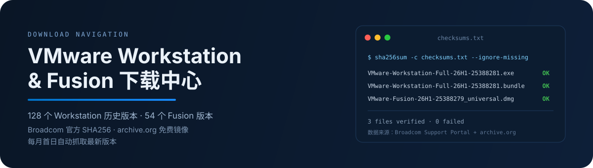

#  VMware Workstation & Fusion 下载中心

    

  

> **一站式 VMware Workstation Pro & Fusion Pro 免费下载导航**

_数据抓取时间：2026-07-06 03:42 UTC_

---

## 目录

- [快速下载（最新版）](#-快速下载最新版)
- [校验完整性](#-校验完整性)
- [Linux 安装 `.bundle`](#-linux-安装-bundle)
- [🪟 VMware Workstation Pro（所有版本）](#-vmware-workstation-pro所有版本)
- [🍎 VMware Fusion Pro（所有版本）](#-vmware-fusion-pro所有版本)
- [免费使用政策](#-免费使用政策)
- [老系统兼容性](#️-老系统兼容性)
- [数据来源与说明](#-数据来源与说明)
- [贡献与反馈](#贡献与反馈)
- [License](#-license)

## 🚀 快速下载（最新版）

> 直接点击文件名下载，无需登录。哈希在下方，下载后请务必[校验完整性](#-校验完整性)。

### 🪟 VMware Workstation Pro

**26H1** · Build `25388281` · 发布于 **2026-05-14**

- **Windows** — [VMware-Workstation-Full-26H1-25388281.exe](https://archive.org/download/vmwareworkstationarchive/26H1/VMware-Workstation-Full-26H1-25388281.exe) (274.34 MB · SHA256 `a0ef9087607d9cad…`)
- **Linux** — [VMware-Workstation-Full-26H1-25388281.x86_64.bundle](https://archive.org/download/vmwareworkstationarchive/Linux/26H1/VMware-Workstation-Full-26H1-25388281.x86_64.bundle) (325.03 MB · SHA256 `3f6d2501e654dbc7…`)

### 🍎 VMware Fusion Pro

**26H1** · Build `25388279` · 发布于 **2026-05-14**

- **macOS** — [VMware-Fusion-26H1-25388279_universal.dmg](https://archive.org/download/vmwareworkstationarchive/Fusion/26H1/VMware-Fusion-26H1-25388279_universal.dmg) (480.71 MB · SHA256 `c1d373aa21be2567…`)

---

## 🪟 VMware Workstation Pro（所有版本）

> **图例**：✅ Broadcom 官方数据（SHA256 权威）· 📼 archive.org 历史存档（仅 MD5/SHA1）

| 版本 | Build | 发布日期 | Windows | Linux | SHA256 | 来源 |
|:-----|:------|:---------|:--------|:------|:-------|:---:|
| 26H1 | `25388281` | 2026-05-14 | [下载](https://archive.org/download/vmwareworkstationarchive/26H1/VMware-Workstation-Full-26H1-25388281.exe) (274.34 MB) | [下载](https://archive.org/download/vmwareworkstationarchive/Linux/26H1/VMware-Workstation-Full-26H1-25388281.x86_64.bundle) (325.03 MB) | Win SHA256 `a0ef9087607d9cad…` 

full
<code>a0ef9087607d9cad20b08139e73e41242e044ad5bd8cee141d3bad314586737f</code>
 Linux SHA256 `3f6d2501e654dbc7…` 

full
<code>3f6d2501e654dbc7701a8290ff6ffcfba6c5444cd5f35f4933cd08c9499f6d84</code>
 | ✅ |
| 25H2u1 | `25219725` | 2026-02-26 | [下载](https://archive.org/download/vmwareworkstationarchive/25H2/VMware-Workstation-Full-25H2u1-25219725.exe) (278.31 MB) | [下载](https://archive.org/download/vmwareworkstationarchive/Linux/25H2/VMware-Workstation-Full-25H2u1-25219725.x86_64.bundle) (296.22 MB) | Win SHA256 `b592c47756d47c93…` 

full
<code>b592c47756d47c932a3ce2c2b83ad3af1fa23ccc1dd1d3166a51bcc1d2bd58e0</code>
 Linux SHA256 `721aa93c4ebcaa51…` 

full
<code>721aa93c4ebcaa51ac6db75ed97c7a4db10aa88110446890db1e40bfafc7566a</code>
 | ✅ |
| 25H2 | `24995812` | 2025-10-14 | [下载](https://archive.org/download/vmwareworkstationarchive/25H2/VMware-Workstation-Full-25H2-24995812.exe) (277.63 MB) | [下载](https://archive.org/download/vmwareworkstationarchive/Linux/25H2/VMware-Workstation-Full-25H2-24995812.x86_64.bundle) (295.19 MB) | Win SHA256 `49ad7c2bbce854ed…` 

full
<code>49ad7c2bbce854ed30ed0702d1af9fc04269777dc981e087bfa7241045b0361</code>
 Linux SHA256 `9beced8a0653c938…` 

full
<code>9beced8a0653c9382e9aa9917168a54bf5635d5e66c8cb341589d72cf14093322</code>
 | ✅ |
| 17.6.4 | `24832109` | 2025-07-15 | [下载](https://archive.org/download/vmwareworkstationarchive/17.x/VMware-workstation-full-17.6.4-24832109.exe) (405.72 MB) | [下载](https://archive.org/download/vmworkstationarchive/Linux/17.x/VMware-workstation-full-17.6.4-24832109.x86_64.bundle) (339.46 MB) | Win SHA256 `10fe3a36f525d88a…` 

full
<code>10fe3a36f525d88aa133118ab3b5a16b18da88d4aa11b14d74e4164b3fb94ba9</code>
 Linux SHA256 `64fbfbaeacc48865…` 

full
<code>64fbfbaeacc48865468114362a2bbaade9110cc9e87bc3bd938396ba7f19a9bd</code>
 | ✅ |

| 17.6.3 | `24583834` | 2025-03-04 | [下载](https://archive.org/download/vmwareworkstationarchive/17.x/VMware-workstation-full-17.6.3-24583834.exe) (401.43 MB) | [下载](https://archive.org/download/vmwareworkstationarchive/Linux/17.x/VMware-workstation-full-17.6.3-24583834.x86_64.bundle) (335.21 MB) | Win SHA256 `d7c04b4dd1e6bf55…` 

full
<code>d7c04b4dd1e6bf551693897d4805e99c45198a830c6361d9af8267b40906857b</code>
 Linux SHA256 `79575917728ded4c…` 

full
<code>79575917728ded4c6d0b89f4ab6a81be9a773c00eeb68d1d12ac0db125478ee0</code>
 | ✅ |
| 17.6.2 | `24409262` | 2024-12-17 | [下载](https://archive.org/download/vmwareworkstationarchive/17.x/VMware-workstation-full-17.6.2-24409262.exe) (447.93 MB) | [下载](https://archive.org/download/vmwareworkstationarchive/Linux/17.x/VMware-workstation-full-17.6.2-24409262.x86_64.bundle) (372.49 MB) | Win SHA256 `5e556b7fc1bd2777…` 

full
<code>5e556b7fc1bd27775143eea930cac68760a1b5dc9b4c089d3fc664cd8439645b</code>
 Linux SHA256 `15536dfc5afbbcf4…` 

full
<code>15536dfc5afbbcf42daec10b1d9d1d6da3ca27da478938defc9c558064ff09f7</code>
 | ✅ |

| 17.6.1 | `24319023` | 2024-10-10 | [下载](https://archive.org/download/vmwareworkstationarchive/17.x/VMware-workstation-full-17.6.1-24319023.exe) (447.93 MB) | [下载](https://archive.org/download/vmwareworkstationarchive/Linux/17.x/VMware-workstation-full-17.6.1-24319023.x86_64.bundle) (372.46 MB) | Win SHA256 `f95429e395a583eb…` 

full
<code>f95429e395a583eb5ba91f09b040e2f8c53a5e7aa37c4c6bfcaf82115a8d3fa4</code>
 Linux SHA256 `7b539aafa8251e7a…` 

full
<code>7b539aafa8251e7a…</code>
 | ✅ |
| 17.6 | `24238078` | 2024-09-03 | [下载](https://archive.org/download/vmwareworkstationarchive/17.x/VMware-workstation-full-17.6.0-24238078.exe) (447.97 MB) | [下载](https://archive.org/download/vmwareworkstationarchive/Linux/17.x/VMware-workstation-full-17.6.0-24238078.x86_64.bundle) (372.46 MB) | Win SHA256 `e34461ffbcb38ca7…` 

full
<code>e34461ffbcb38ca7baa7928f7f37575ef31129961099eae96b43a64b06462778</code>
 Linux SHA256 `5e9e8e01278bef64…` 

full
<code>5e9e8e01278bef6408a360ff2f56218c2ee62854735be8d9cbe2dc61811ca0dc</code>
 | ✅ |
| 17.5.2 | `23775571` | 2024-05-14 | [下载](https://archive.org/download/vmwareworkstationarchive/17.x/VMware-workstation-full-17.5.2-23775571.exe) (618.26 MB) | [下载](https://archive.org/download/vmwareworkstationarchive/Linux/17.x/VMware-workstation-full-17.5.2-23775571.x86_64.bundle) (510.58 MB) | Win SHA256 `2c3a40993a450dc9…` 

full
<code>2c3a40993a450dc9a059563d07664fc0fb85ae398a57d22b1b4bf0e602417bf7</code>
 Linux SHA256 `a9da5e9b785ab98c…` 

full
<code>a9da5e9b785ab98c6f6d90f0ebd9cde6e6da3ca27da478938defc9c558064ff09f7</code>
 | ✅ |
| 17.5.1 | `23298084` | — | [下载](https://archive.org/download/vmwareworkstationarchive/17.x/VMware-workstation-full-17.5.1-23298084.exe) (594.29 MB) | — | Win SHA1 `1118f68f6316…` 

full
<code>1118f68f6316a0ec573c55e77f5bf1e355db1e6a</code>
 | 📼 |
| 17.5.0 | `22583795` | — | [下载](https://archive.org/download/vmwareworkstationarchive/17.x/VMware-workstation-full-17.5.0-22583795.exe) (571.76 MB) | — | Win SHA1 `d1b44046f0ba…` 

full
<code>d1b44046f0ba37ffd0556d6912af8d038bf9ec81</code>
 | 📼 |
| 17.0.2 | `21581411` | — | [下载](https://archive.org/download/vmwareworkstationarchive/17.x/VMware-workstation-full-17.0.2-21581411.exe) (607.70 MB) | — | Win SHA1 `9c9e229a5a80…` 

full
<code>9c9e229a5a804ced52efff3ba618c3297dfe81ca</code>
 | 📼 |
| 17.0.1 | `21139696` | — | [下载](https://archive.org/download/vmwareworkstationarchive/17.x/VMware-workstation-full-17.0.1-21139696.exe) (607.72 MB) | — | Win SHA1 `183306b1491f…` 

full
<code>183306b1491f4316eaf3d00cf2a4e74e7a6ab63a87c66ae32ae32</code>
 | 📼 |
| 17.0.0 | `20800274` | — | [下载](https://archive.org/download/vmwareworkstationarchive/17.x/VMware-workstation-full-17.0.0-20800274.exe) (607.88 MB) | — | Win SHA1 `d244b21b1979…` 

full
<code>d244b21b197943b706a2c2b4ae5b0f661a177dbd0f6616beb6c66ae32</code>
 | 📼 |
| 16.2.5 | `20904516` | — | [下载](https://archive.org/download/vmwareworkstationarchive/16.x/VMware-workstation-full-16.2.5-20904516.exe) (615.58 MB) | — | Win SHA1 `01ddbeb17944…` 

full
<code>01ddbeb179444bb6bf9ee41e070de362c6134ce9</code>
 | 📼 |
| 16.2.4 | `20089737` | — | [下载](https://archive.org/download/vmwareworkstationarchive/16.x/VMware-workstation-full-16.2.4-20089737.exe) (615.58 MB) | — | Win SHA1 `b89035349ad4…` 

full
<code>b89035349ad4894e1837b81e3e826ca4572f4f88</code>
 | 📼 |
| 16.2.3 | `19376536` | — | [下载](https://archive.org/download/vmwareworkstationarchive/16.x/VMware-workstation-full-16.2.3-19376536.exe) (615.43 MB) | — | Win SHA1 `056fd5a5417d…` 

full
<code>056fd5a5417d6db976aa2fb2bf585dd2e71be996b</code>
 | 📼 |
| 16.2.2 | `19200509` | — | [下载](https://archive.org/download/vmwareworkstationarchive/16.x/VMware-workstation-full-16.2.2-19200509.exe) (615.42 MB) | — | Win SHA1 `cb8b579fb7f4…` 

full
<code>cb8b579fb7f4cc1ec1c0ae4332393c02713afa76</code>
 | 📼 |
| 16.2.1 | `18811642` | — | [下载](https://archive.org/download/vmwareworkstationarchive/16.x/VMware-workstation-full-16.2.1-18811642.exe) (615.54 MB) | — | Win SHA1 `e5b23407e62b…` 

full
<code>e5b23407e62b34623b0c57843313c0731bc8dd04</code>
 | 📼 |
| 16.2.0 | `18760230` | — | [下载](https://archive.org/download/vmwareworkstationarchive/16.x/VMware-workstation-full-16.2.0-18760230.exe) (615.50 MB) | — | Win SHA1 `cfef03316159…` 

full
<code>cfef03316159a86474528c3dc3b088171b77b63d</code>
 | 📼 |
| 16.1.2 | `17966106` | — | [下载](https://archive.org/download/vmwareworkstationarchive/16.x/VMware-workstation-full-16.1.2-17966106.exe) (621.29 MB) | — | Win SHA1 `1c8000cbec77…` 

full
<code>1c8000cbec775ab5093312def8e61799eb66ae32</code>
 | 📼 |
| 16.1.1 | `17801498` | — | [下载](https://archive.org/download/vmwareworkstationarchive/16.x/VMware-workstation-full-16.1.1-17801498.exe) (621.48 MB) | — | Win SHA1 `172a374b1ed2…` 

full
<code>172a374b1ed205961feb5b017145a27e20c22ee0</code>
 | 📼 |
| 16.1.0 | `17198959` | — | [下载](https://archive.org/download/vmwareworkstationarchive/16.x/VMware-workstation-full-16.1.0-17198959.exe) (621.55 MB) | — | Win SHA1 `7c02662a7570…` 

full
<code>7c02662a7570608e61c86a9859eda7b0f661a177</code>
 | 📼 |
| 16.0.0 | `16894299` | — | [下载](https://archive.org/download/vmwareworkstationarchive/16.x/VMware-workstation-full-16.0.0-16894299.exe) (619.26 MB) | — | Win SHA1 `29f7e060ed8b…` 

full
<code>29f7e060ed8bff4015ed137374734531d8fb2670</code>
 | 📼 |
| 15.5.7 | `17171714` | — | [下载](https://archive.org/download/vmwareworkstationarchive/15.x/VMware-workstation-full-15.5.7-17171714.exe) (552.28 MB) | — | Win SHA1 `f8354f02fbd3…` 

full
<code>f8354f02fbd3…</code>
 | 📼 |
| 15.5.6 | `16341506` | — | [下载](https://archive.org/download/vmwareworkstationarchive/15.x/VMware-workstation-full-15.5.6-16341506.exe) (552.35 MB) | — | Win SHA1 `aa610c1f0800…` 

full
<code>aa610c1f080069e2cd74e4d8b6c64cb94b05f2d5b2532364c</code>
 | 📼 |
| 15.5.5 | `16285975` | — | [下载](https://archive.org/download/vmwareworkstationarchive/15.x/VMware-workstation-full-15.5.5-16285975.exe) (552.38 MB) | — | Win SHA1 `43e1607f1b8a…` 

full
<code>43e1607f1b8a3d27d06b798cb74fea7eeb994fb7</code>
 | 📼 |
| 15.5.2 | `15785246` | — | [下载](https://archive.org/download/vmwareworkstationarchive/15.x/VMware-workstation-full-15.5.2-15785246.exe) (541.97 MB) | — | Win SHA1 `4c193f1f0586…` 

full
<code>4c193f1f0586a531c32752a5d5df976c3cb9ad8a</code>
 | 📼 |
| 15.5.1 | `15018445` | — | [下载](https://archive.org/download/vmwareworkstationarchive/15.x/VMware-workstation-full-15.5.1-15018445.exe) (541.16 MB) | — | Win SHA1 `878fadf96c1d…` 

full
<code>878fadf96c1d110f626c9042446b65d6d0954</code>
 | 📼 |
| 15.5.0 | `14665864` | — | [下载](https://archive.org/download/vmwareworkstationarchive/15.x/VMware-workstation-full-15.5.0-14665864.exe) (541.05 MB) | — | Win SHA1 `8cc5a4554aba…` 

full
<code>8cc5a4554abaf71bd538abddad2d07ee3daab9c6</code>
 | 📼 |
| 15.1.0 | `13591040` | — | [下载](https://archive.org/download/vmwareworkstationarchive/15.x/VMware-workstation-full-15.1.0-13591040.exe) (513.26 MB) | — | Win SHA1 `45b42919f165…` 

full
<code>45b42919f1657f46eed04601756d4281da405599</code>
 | 📼 |
| 15.0.4 | `12990004` | — | [下载](https://archive.org/download/vmwareworkstationarchive/15.x/VMware-workstation-full-15.0.4-12990004.exe) (511.30 MB) | — | Win SHA1 `ef3e05da30e3…` 

full
<code>ef3e05da30e3f3b17cb704f5a0f5edae2d3</code>
 | 📼 |
| 15.0.3 | `12422535` | — | [下载](https://archive.org/download/vmwareworkstationarchive/15.x/VMware-workstation-full-15.0.3-12422535.exe) (511.35 MB) | — | Win SHA1 `c18f4a74c7af…` 

full
<code>c18f4a74c7af5bece33df3402ed6e88f30a4f8b2</code>
 | 📼 |
| 15.0.2 | `10952284` | — | [下载](https://archive.org/download/vmwareworkstationarchive/15.x/VMware-workstation-full-15.0.2-10952284.exe) (511.84 MB) | — | Win SHA1 `2c4658abe070…` 

full
<code>2c4658abe07052fc90854242cae933c662991e7d4b</code>
 | 📼 |
| 15.0.1 | `10737736` | — | [下载](https://archive.org/download/vmwareworkstationarchive/15.x/VMware-workstation-full-15.0.1-10737736.exe) (511.87 MB) | — | Win SHA1 `4ae1351fe969…` 

full
<code>4ae1351fe96948c46267f49d4f4e448e6f6</code>
 | 📼 |
| 15.0.0 | `10134415` | — | [下载](https://archive.org/download/vmwareworkstationarchive/15.x/VMware-workstation-full-15.0.0-10134415.exe) (511.75 MB) | — | Win SHA1 `ede6d31a5bd5…` 

full
<code>ede6d31a5bd5071f1fb0134992063e3ed9ae39a6</code>
 | 📼 |
| 14.1.8 | `14921873` | — | [下载](https://archive.org/download/vmwareworkstationarchive/14.x/VMware-workstation-full-14.1.8-14921873.exe) (487.14 MB) | — | Win SHA1 `2aa5a35487ec…` 

full
<code>2aa5a35487ec36f76aa6e54c1c76d9009bd33772</code>
 | 📼 |
| 14.1.7 | `12989993` | — | [下载](https://archive.org/download/vmwareworkstationarchive/14.x/VMware-workstation-full-14.1.7-12989993.exe) (487.15 MB) | — | Win SHA1 `7c7c8205a3c6…` 

full
<code>7c7c8205a3c67b6afd69d75f7d68291bcc5fb4e6</code>
 | 📼 |
| 14.1.6 | `12368378` | — | [下载](https://archive.org/download/vmwareworkstationarchive/14.x/VMware-workstation-full-14.1.6-12368378.exe) (487.14 MB) | — | Win SHA1 `7ed4c1040a1c…` 

full
<code>7ed4c1040a1c1b176fac4fac9fcb4e077a88deed</code>
 | 📼 |
| 14.1.5 | `10950780` | — | [下载](https://archive.org/download/vmwareworkstationarchive/14.x/VMware-workstation-full-14.1.5-10950780.exe) (487.13 MB) | — | Win SHA1 `61ed621cbda3…` 

full
<code>61ed621cbda3db7f3ce796b9c1b74e5a26d869707b</code>
 | 📼 |
| 14.1.4 | `10722678` | — | [下载](https://archive.org/download/vmwareworkstationarchive/14.x/VMware-workstation-full-14.1.4-10722678.exe) (487.12 MB) | — | Win SHA1 `af4925fddf99…` 

full
<code>af4925fddf99960fa08d5f8e5d49b40ae5b426b4</code>
 | 📼 |
| 14.1.3 | `9474260` | — | [下载](https://archive.org/download/vmwareworkstationarchive/14.x/VMware-workstation-full-14.1.3-9474260.exe) (487.09 MB) | — | Win SHA1 `217caef2a01a…` 

full
<code>217caef2a01a8f7e4456d657ed9c9ac5b4e9134566d6c</code>
 | 📼 |
| 14.1.2 | `8497320` | — | [下载](https://archive.org/download/vmwareworkstationarchive/14.x/VMware-workstation-full-14.1.2-8497320.exe) (487.08 MB) | — | Win SHA1 `e4f69ed194fe…` 

full
<code>e4f69ed194fe46a266e56cd6c83d662ed477b7b</code>
 | 📼 |
| 14.1.1 | `7528167` | — | [下载](https://archive.org/download/vmwareworkstationarchive/14.x/VMware-workstation-full-14.1.1-7528167.exe) (465.21 MB) | — | Win SHA1 `06e0dd8615f5…` 

full
<code>06e0dd8615f5a085768605f6c50f5fa924b450f6465b</code>
 | 📼 |
| 14.1.0 | `7370693` | — | [下载](https://archive.org/download/vmwareworkstationarchive/14.x/VMware-workstation-full-14.1.0-7370693.exe) (465.23 MB) | — | Win SHA1 `c083db65f65d…` 

full
<code>c083db65f65d74e58576860d7b82feb90a5d2b7f66165d6670531e7c4b</code>
 | 📼 |
| 14.0.0 | `6661328` | — | [下载](https://archive.org/download/vmwareworkstationarchive/14.x/VMware-workstation-full-14.0.0-6661328.exe) (462.92 MB) | — | Win SHA1 `9e0c1154bd24…` 

full
<code>9e0c1154bd24a6f694545b88e52f685a61447c24f36ce0c1c66f6c1b1b06d4f</code>
 | 📼 |
| 12.5.9 | `7535481` | — | [下载](https://archive.org/download/vmwareworkstationarchive/12.x/VMware-workstation-full-12.5.9-7535481.exe) (400.86 MB) | — | Win SHA1 `7a744739357b…` 

full
<code>7a744739357b5adb33172b1e30c949e4b285c4c7661650fd7c45ce7f3f8b436b</code>
 | 📼 |
| 12.5.8 | `7098237` | — | [下载](https://archive.org/download/vmwareworkstationarchive/12.x/VMware-workstation-full-12.5.8-7098237.exe) (400.83 MB) | — | Win SHA1 `c98661661a09…` 

full
<code>c98661661a09d465ed66a5f7d2b668e7d483fd0b4c6cd6f81b8</code>
 | 📼 |
| 12.5.7 | `5813279` | — | [下载](https://archive.org/download/vmwareworkstationarchive/12.x/VMware-workstation-full-12.5.7-5813279.exe) (404.92 MB) | — | Win SHA1 `972cc16deb66…` 

full
<code>972cc16deb66855fa2147b44687f3c6f65e7b9e5f6c3463cd8ed8425d5f7b</code>
 | 📼 |
| 12.5.6 | `5528349` | — | [下载](https://archive.org/download/vmwareworkstationarchive/12.x/VMware-workstation-full-12.5.6-5528349.exe) (404.92 MB) | — | Win SHA1 `79b3cd66e4b8…` 

full
<code>79b3cd66e4b8edc95d6d26d0fcd6e6b9b8c5dfb2a6a5e6c9f91b</code>
 | 📼 |
| 12.5.5 | `5234757` | — | [下载](https://archive.org/download/vmwareworkstationarchive/12.x/VMware-workstation-full-12.5.5-5234757.exe) (400.53 MB) | — | Win SHA1 `6cc1fea02028…` 

full
<code>6cc1fea02028bc55e5750cab72b43068ed4564c9bdb40ea237d4f</code>
 | 📼 |
| 12.5.4 | `5192485` | — | [下载](https://archive.org/download/vmwareworkstationarchive/12.x/VMware-workstation-full-12.5.4-5192485.exe) (400.47 MB) | — | Win SHA1 `afb6f920d2e3…` 

full
<code>afb6f920d2e3ad5a2d7f750f501b6b4b31f6a80f1d82b</code>
 | 📼 |
| 12.5.3 | `5115892` | — | [下载](https://archive.org/download/vmwareworkstationarchive/12.x/VMware-workstation-full-12.5.3-5115892.exe) (400.51 MB) | — | Win SHA1 `6a41430c77f4ebf3c6c614b3f650d65b6c724fad64a5c16b6d6acf6b456b7e74b0bd5b0b292f66e567c45d56cdb3662f5edbeb3cdb6f2c4d</code>
 | 📼 |
| 12.5.2 | `4638234` | — | [下载](https://archive.org/download/vmwareworkstationarchive/12.x/VMware-workstation-full-12.5.2-4638234.exe) (303.68 MB) | — | Win SHA1 `512ccf2a89b7…` 

full
<code>512ccf2a89b74fb05807928fbf0638191a1ebd7b4585f5c7edb45e3bdb47b5d2bdf6b</code>
 | 📼 |
| 12.5.1 | `4542065` | — | [下载](https://archive.org/download/vmwareworkstationarchive/12.x/VMware-workstation-full-12.5.1-4542065.exe) (303.67 MB) | — | Win SHA1 `e404617222a5…` 

full
<code>e404617222a5a58370ea39ec110b7341e734e5fa92d3cdb6fd7b7d5d0fceb273b45e3edb6f3f4e1dcd8ed666b2be12f</code>
 | 📼 |
| 12.5.0 | `4352439` | — | [下载](https://archive.org/download/vmwareworkstationarchive/12.x/VMware-workstation-full-12.5.0-4352439.exe) (303.64 MB) | — | Win SHA1 `bacaa3b74484…` 

full
<code>bacaa3b74484dea9fdaf7bd5ad02935c90841632b3c668e7d5c7b5c908416327d9f66d85b7d25364567fdfa6bda4f69b8d31b8e46e64f6d8a6b995fbfb84bf5b</code>
 | 📼 |
| 12.1.1 | `3770994` | — | [下载](https://archive.org/download/vmwareworkstationarchive/12.x/VMware-workstation-full-12.1.1-3770994.exe) (293.67 MB) | — | Win SHA1 `9569831eedae…` 

full
<code>9569831eedae5bd66a66237b3f6d49ceb70b6f5d8d204ed9d7b563c6663b1d6f29cb62d6cbe2567d5f64bdebb1356b5a6a8fbfd7b35f5c3e6c625d3d4b7d18a5bc15e4c64b5d6f8f3c54389b4de6a6fcec5c37b5e5fbb6fb0</code>
 | 📼 |
| 12.1.0 | `3272444` | — | [下载](https://archive.org/download/vmwareworkstationarchive/12.x/VMware-workstation-full-12.1.0-3272444.exe) (293.26 MB) | — | Win SHA1 `b8096e025e30…` 

full
<code>b8096e025e30b6d5d2b6f7b27bfd345a460b6a6fb76623b1f67b47c785fbfab6d5c66b2e7d2bdb66eac18095d6f6b5f6d27eb8f8edb4fcd6f70d6b925f46bd0f5bf84b0f1d4a1e5b96d35a6f3b724fbeb63629cb7f2f5c6bdb6fcec66bdfbd244b7d323f662b6d6b9b5f6d6a5abfcdb6e6f6d6b9b3f64fdbdfbf8b</code>
 | 📼 |
| 12.0.1 | `3160714` | — | [下载](https://archive.org/download/vmwareworkstationarchive/12.x/VMware-workstation-full-12.0.1-3160714.exe) (292.41 MB) | — | Win SHA1 `d2daff481fbf…` 

full
<code>d2daff481fbf9f2d48bf9f2b4f6c5b4f214d8b18a5c7b5d6b6d68f4ed69a73f4e8f889f0c6361edb6d7b9d38bd63bdebdf0fbfd6d6b70cbc81b5f6d6b25b4a5b35e5f6b6d2d6fa4aedb6f4dab8f6e68e2f55a8dbb6d272fd6b9fdbd8bd5b6d6b9b1e14b37b5c6b60b4b3d3c62b6fd7c1bfb36cdb4fcdab65c9c66b2d5f4e5b9edfcdb37b5d6fbfab9f7b81b2a9fa7fbdf4b</code>
 | 📼 |
| 12.0.0 | `2985596` | — | [下载](https://archive.org/download/vmwareworkstationarchive/12.x/VMware-workstation-full-12.0.0-2985596.exe) (292.11 MB) | — | Win SHA1 `40888fbc4eb5…` 

full
<code>40888fbc4eb50dd81d9d5d70f3cdc6627bdf9f6b9b1a14b0b2c3c66b7b5d8e2e3f6b5fcdb0f7081b1ed5b8860f6cd6f5d65b9f933cdb66b7d6cdb5d9a8e5c6f8a851bfd32b5c5f35b3c266a4d0b59f6d6a3b6f6d6b3ab1b01e850fbe3e6f7b9b109f1eb66b5f6d6a5b4ad8dfb6f6d6b7d2d6f25b6c25b6d6b8dfc665b4e5d8f6f6b5f6d2b33f2b85b8d3c6c69fd36bdb6d6b5d9b7d2cdb6f0b3c6cdb7e6fd6b4b0bdb6bfb9b4f5c6b7fdfc7bdfad9dcd9b66c24abde45603d6cdb77e66b6fbdb822b50c5d1b0f7b6bda456edb4fcdb6f0f5cdc36aedac40f56b6d5febfbc36b0e15b7e64eabf9f0f5b7b2b8b2f5c6cdb6f6b5b0cdb6b5f6d6b5e66edb9f7e41d2b3b4f5a0bf650c9f8bc34d41eb6d179dabdfb6b5f6d6edb6d2b5f7b8f4b0b9d36b8e2f0f5cdacb75f9f4b4f57b3b6b6f6bdb5d5f32b3cb6f6b7d2f6bc9b8bcb6bda6c6c1b4b5fcd6d6bdb6f6b5f6d6a5de6b6cdbe762edf66d6e61d1edcdfb2f445acf96cb86d67edbcb2c6f6dbcd6f6bdb60d0fbf1b01b6b3b4f3bdb6b8b6f6b7d2f6cdacf5fbcc6f1f9b4f8ad74f5cdb6b8edb7a1f5d67c6bfcbfd2fbdb6dfbdf2df364edbe45b6d5f66e68b6d6b5d62f046bdb7d3b4e1b1f1cb6f7d72f5c676b4cdb6f6d2f6b7edc4d5b6edb2b7d6b9beb5f0bfb9f6c6f6bfb</code>
 | 📼 |
| 11.1.4 | `3848939` | — | [下载](https://archive.org/download/vmwareworkstationarchive/11.x/VMware-workstation-full-11.1.4-3848939.exe) (303.11 MB) | — | Win SHA1 `0c72dd9fc886…` 

full
<code>0c72dd9fc886d7c9d6f5d6a9a667b377b3fbbf1e7b6623bd6b6d6d6b18e26235b66b6fb8e8c4b709fbca6d8f6b3c6f6d6a5bdf6b9d65fce324ddc66d9b1bde2b4b9c64d9bdc5fd35b1b31b66b5b9f6d3cdb6edbde75a3bdb7f5c62f6d6b6f6b45b0bf85f6d2f4bdb0fb950bdb3cb7cdb2c3f6f6f6dcdc65d6ed5b765b5bdb7fbf09ed6a73a66bd1d9f5c16f6b7d06d6b83cc6c3bdb25b9dfb34b3b5fdfb5e77b7df6b86d5a0d96b7f6b4d9aeb34b3bdb0bdbdeba7fb75b65d6d8e6e1b3b1bf0f6a4f650b65f6cd6b6d3b6ed345b3cdb6f0c70f5c6b6f6d27d0bfb6fdfb7bdfbfdfd7f3f3cdc6ccf27e2f5b8d4b1bdfd8fbdb73b25d25b1b4f7e4c69fba7feb6d6b0c6b4bdf5c2e04b6edc6fb2f5635b6f6b5f67b0b5e2f6dfbbda72e5c6fcd6c177b34fbda753d6f6e2a2ce65fcf7d86b5fbfc64b9f21fbab4f5bdf6cdb855f6fcf8ab00d9b6d8d4e0d5b0d0fd0f9f7d63b0fb7f4cd8bdb8e6bebfb66dfc36b50b1fb6d6b6dfbdb2b2f5b0bdb9c7f29b84e4e4fcd6c77bdb7fcf6b36b7fd6b6b5b0cdb77f3043f6d5cd30b7df1f4e2fbb76bf7b6f8bf9a45b8dfd6b79f68b8d2f0bfbcb4a7e33d72f6cb8df57d2bdfc3d6d6c6b6b2f7d77b3b0bfb66bdfc7bfc66f9b6d6b5b0b6b2f6c6b6d1fb4b38ccbfa6f49b159b2f6b9a66ad75b6b320b6f6d793fbfb0ac50d5fcfa48d7cfd462f24d68b4c7d27db7852bfbfb9a1e75d76d2cd4a4b0f5d4b3b4fbc29f6cdbcbc6d6bc7fba7b6f66edbcb0b00d1b5e3f6b4b4fbd4d4f93b6e11f6edba5a7f3b6f6d6b65dfbcb6c7f69c6fce92f5fcfc26d0f2b7c85b35c6bdb7f5bfb66be96b70b6d2f4b4f9b9b2edb4dfb7a0e25df7b5cd5f6d6f5b5b6b1cdba6f2b6d6b3f6d7b7edf6d6b6cd7b74e2fbda856b4f3edf6b5f6f77b4d7fcdb87f25b9a6edf6d6cd4abba6f34bbf62f8f4fcdbc1cdfa6f916bcf6b4cbfd9f7cbfbd36e976d26b8c8d4c9c1b9a43f6edb4a614c9f66b85b8c6a08f6fcdb7bdb45d2c65c7cb24bd26a566b3d7f2b7d6b66edb77fcd6dfd0b8f7c654bddb68b6b5d6cd85bfbfc6b4fbb52f6f5b0bb08d5c7cdbfd0f9f72d404dfad1b92fb29b4b43f696d8a767b75ccbfb5ef8bc3d2a3fb0fcbaac47cdfb8ad7fca6f09081fbbe16f2ccf7a88fdf2fbb6df6bf75b6fd56bc69f2d3bb3cdbf2f31dfb95c01e4616d4cfc7b90f7f8fdfd3f6c6b5fbf5b4a7cdf0fb8fbf6d6b6b7edb6d6b5b6d9bba5e5c7a2f9bae6f77b6d31d3bb1f2bdfbd4ba08c3d64cd7b5cfa8dfc6bc77e4b5f6cb7a8a7bdfc0fbf4bc9b5d4dfb08d8d60c2b7d6b3f66b5d3ed4b0edf0f7d7f8b7fbf3b5cdb6e5c66fb2c6bc34b5f8cfaac8a5e420edfbb7f02ac3fbd50f213f9dfd266f6b6cd9b7f7ba7b4b6e61efc0dfc87bda504db6fcbd35b8b458e6b7f5cd50fce7628bb29c0edf975bbadf1fa708e0ca2fd3bd6d4bcbd974f5a9e8d3fcd62b3baab7f6d37b7acf5cb6d6cb2fcc6f67b1fbba77b7fdfc2d774cd6f84bb4b0f2bf50edc92b7f86c3f4d5b3b6d6b7d2f6b6d6b5f5bcc83d6b4edf9b7f0acf6d2ab6bdb8f5b7f2b6d6b9b6dba7fb60fbeb6d4fbb73b625f6bf4a0acf64ab7a9f4e57f6b6bdb2f6f0c3bfc45bdfc9e50bca6cfc2cdb6ad6f7d7b9fd06dfb70d47f0e469b5f6cdacfbd9d03e2563f48b7fbf7b5fce26edb6d6b6b5b2fbb9e6f7c7b5fcdc6fcfb9277f8d4cdb77b6d6b85b6d8d4c5c6c6b1fbbadf266b6c3abf50f7c32b4f7fba75bfb6d6b6f6b5b5dfd65c5d6b7ba9cdf8f3dfbd39ba58b0a4727f5d5c4cdc6cba9bf45e95d4fbeb3cfb98d2badb65e4b4fb91d6f8d83d47b56cdba4a2c1e8c16f77b3b5c6c6dfb5fcb7e6b6d27e07b5cdbc7f65b2f6a85b5c7f0b7cdb6f5f6cd6fde4dbd2fbe7bdb3f86b256b6fcdb0f3b3c6f5d3e3fbd4e8e6b7d6b7cd6fbc65b7f4b6fbb6bc74ef32f6b6edb38f8e2edf4f95cdbc14bdf5ac6ca07b40e8006e8c4cb86fd5b3fa80fba84f77badc1692fca697df5f1d6e3cecb4adfbfb93e64edb5c2687cba85fbf95fdf29b6fc7a7fbfab6c1c1c6b9be45fbfb6d7cdfb4f1b9b2ed8fbdf3c8e6cd870b55e8d4bc6d66f6b0f7cbd2f5f5bc6a7d7f91ce5ad861b37df5a0f89f6f6b600f32bd2f3d7691f6be7cc0c2d3b4c6d1b3b8b34fb6fbd2fbfb3b9c6d6f7b5e6b9b9fbdb6c1f9c9a134c55fccb3cbc020f2c3d7f42cc6fbfbfd5d7a5d17bfb133f44f5bdbc65b77957fd5b3b3b9d7d45fbf5367f7ef2b69d5a3e8d9bcda93b7cb70f4bd4b7613e9f0fbf8c4afb5dba9d247a4f7fbadfbaf85b4f4c6aedf86b7fbf3f2a68d6b5d86b8cbc9b5d8edc7fc6f66badfb85c6e605ce2a27fba0aedc4f6cb14b1c2cb9d97e6cd48ed6c081f3c3bc78a5d0fbb8fbfb7c6fb6d2c7d5fadba70d6b5c76a1dbdc5b6b223ad5fc4f6fbdfbeb6e5b5d8d44fd5f6dfd5a3f6d4f59c7b9c4b2e172ce7badf7fb956fba7b3f67b2f5d7baadfca6df3d8edbe4f951cbc0c4cdf2d70b8f3b3ed1d3fbdfba7f3b3b06cb3c2bdb1b1bfc1d5f76e9a90f88d6edfbf60bd7fbcd7f45482f6cc0f75cbfb3c6647c576b4fc94b4f5c3cf8bdfbbfcc95fbcdf5c84cdc67b2cb8d1cdf79e6dfb2d6b9b3f8c6d1fb5a7f7c61ccf07a9f70c96c7fd82c5b7b6d6b77f5c7f6d4a8f0c6ccf955f8cc75c1bcb7d2dfd2877b5b3cdc79b7df3fce8914f78e3c61cdfd7dbb4edb3b4d6c5b9c9f5b5f7f2d6dfb0c11c3e4dfd4c47cdc6a273efc3abfd0e7d8db5fb80a3e9ccf8b33b31e1f8cdc97a965c5b4cdb4c8f71f63bc0c42b93bf5e457cd3a7f265c1d7bf4f5fb7c5a9f7f3acbca68e92d9b81c6d27ab66b5d6b7fcb8bcb6b34f3e8f6cbcc8b3dd5d76a7f0f96ed66f6c7bfb5e37cd9b7dcbe65f6c7f3dfcd3f3bf3a0fa822e86b7b6ed6c4f6a25fd1a1f576bdadf3ed7c0d6cd65fc84b9357a7f81c1a5400df0f3dfb3365d5bca2a65e7e71cd30a4c5b673ab7b5fdfc5cbca84ba7f85b0bdb9b225d4b63c7c4dcb1b2c85dc44c66b9f5d4ab1ef84b2d34c921b6e2e588edbc4b7fbc66e32ba6d7c3a7f5a7fbcbc03a819f61cb3fcdb8f7f9a6cd34d6c1d5c9e5bcc6fbda923edb4fa231f6bfb7cbcd4d2f66f1d85cba9a1cdf86bc5f8f1c6d6b7b9f95edfbd252edf5bf4b295c7b8a83cdfbc71dfc04b7d29f5ac36b45a6fc9b1bd05fd0ed7abccfb6b75b8ad6a4b7a8c6c7a9ef6aab95f4e6de9a4d1bbadbadfc52d6dfc9acbddb5f77b4d74fcb46bf6b0fd0fb59b5d7f85f786f4b6cd6fce3b7dfbf6bdbad89c6f62ce5f0f6be3e5b5cd43d6c67b6f4ddb9ba70f5c565f5b7f5e4b4e7fcc1bd37bc6b6edb4a67c8864c1d6fb1f7badfb8fcfc53cb1d1cb1e86c6e53dbd2d4a1b2d29e8f5b7d2a355c5fce0c1fb5d9fc97bfa45e6b4f0bd3dc1e8b66d6b5e6b94cb4ad855cd61a62ceb6c6b740d5d6c67a9c6cb8d7fcdb2f3edb2bfc85dca5cbad16a9bb42b76fb6b8df6cdc53fa1a75a3b9d64f560a9c6b7f3c6dfdbd0a109c63d3b5e8b5ad4cbbe00a0ad96ef4695c2c5cd7f9bbad0bfce90fbc4f6d7b7bad86c6f0a301cbcc91f60e60d6c99bf95c77bdf56b9b1ac1f607d3b6f6b3d4c1a5cdbfcb3bda0c7adbc4b7dba7a5ed4374e1c5fbb5cfd6cd2bde6c0fde6ed9b4fa0bd9f355b7d3c7f9ce65b3d4f5d0b704b3d7f3c4f9fcc4111b3d42f6c7d432bfbfd7cb7db82cd65e9d9cb5d4abf3a5acb3d45acb4e5cd81adf5c7bb4cdc6f66f9bc8e34edbb0297cd6b5f2d2b7e48cdf4d7b1fbdb68dbf5b6e76b7fdc4f3b6bb34dba8b5d8adfc81cbe24b1ce2a6fb7bad07d2cb4be9ed4be3b3fad77fdc74ddc395c861dfdf04d00a8ffc4b7f1b6e61f9a5c4bd2b8cd7f7b4ad61b2c1ac4f4c6cd7e3cfbcb4d3a91f5af64e1d7f3f95c6b6f34b6bb0c6ac52b7cc4f49d7fcd462a76ebac0cfb95ed6a6cd415e8ceb4dae7b3fca6d2f40bdfdf60cf6ad57f5bfb0cc59e19cbef6d8b96d0bfa3d6bc29fca9c3fccbfb9d58bcbadefba69f6d7bbf0dcd79fbef37f68b6c74fd46afbf5cc3f546a111b754d66b8bad0f869d76dbcf01fb8d9fcbf87d9cd4d1a49b97b7d8f7f1bfb82f8e3b5cc02f4c1f36bc0aacb75ed635bfc5abf6d7abbf96f63fb4cd3af19fbf2be38cd99fbf34b13fbad5f3bfd484fbadfbf2ad37b9cdc9d921ed6cbc648ad7ce6e9cc0bad5cf42f4a5bda5ad879b5be45edf0a944bd96c1c13ba8d4ce6f0d40b96f6d7f6badba7ed5b6d9d4fbad86f6b7f5cb5d99a4cfb4d57cd8bd2fce80f0f4be7fcc3bc45f6bad0b7d2f3bcb4cdb8f365df4bf94a4b6ddc7d9f4cd60960bfa8d4f96ed5b88afcd0b7ab0c35f57fa8cbc978f5d3e3e7f56dfb9fa68c2bf10cdf3f7f3c41e66c7b4bfbf5f6d5c7f79e27bcb7da9b7a29fcd0fa74b4da86ed94bda3b5cb4f4a37d4fbcab73bfbbd7cd3d4a0a4c370d5b8dbb79f6b7edf7b3b9b7f5cbfb4adbf56dca0f6ce0ca8c7e5b8f6ed9a5b7aed6a1ba7c4b25a8f5ed7fdc5cdf94b85ccb6e0bd9bc6fc7d0bfa87f784bdfbda4cd95d6c8f3b885ed14bdc6f2c76f6ad3e3f16a7d92bc0c67b8d4f71bca5d34e16e9fb0d4f413cbc89fb4badfd5e42bf86cd0acfbe7f6c6f8dccfcc7f5cc8a7cb3b55f2a9baff19bc99bfa69dcb3bbfcb7fa9fdcdbcced67f5a95a7d7fbbf6e1a8b93c6d3a3bc6f85b7d6bb5f0f9fccbfd5fba2f7e4b4f5d3bf5cd7f4dcfc3f2fcd4fcb7d7a2cba5fd2b0fa5edb7d6b9d0cf7c80df8b7f0cdad6ed9a4ef8badab0bdc2adfd93bdb5f6a78dcdf7a5cdce4c7e7c42fc91edb2a5a279aed9f74c5cd28dac073ccedc4cd14d474bf65a4fd6d94edba2c1d5b2f6d7b2f047e7f7a6c2cc0ce4f73b7db85d4bc3a5c1bc0c3bdacb9e19fdfcbe0dfc2f6f9cba77d90fa01b5d0b6c3f5cd6aefca0d01ad35f5d0fc9a6ac07d6ad63ed8ddb8b34d77fd67bca6d69af5bcc5f63b70dfa6d4d7fb0fdf8c925d0b02a7d5c62c8cd3a6ef9f496d5a6f7dba69d4ba9d9bd4c5c5e9d4b97bfd7b6e5c6c77d4bdb8df0c6f6e81c4bc7a8cb05c82ca9e84badf9f0e4cd4f5edc3ef3fbf70cc3a6c96fbba7bdf98dd9002b35f7146402f3bbd57f5e0fd66bfb0d3c3f4f9ed66d7bdc1e5b34b5e9bfd0e33c4abf8e85cbe4dfa72d6c8a5ebaf2cc0e5b42d76edf5dccb6c66c2bcb70b3af7d9b2a86b4f2d3ac6d3be8a99b3f6fb45dca6bdb5fbfc3a6de7dfd9e16f85fce2d5a5c6cd9bda99fb3b2ba4cdbcf52fbe91c6fa2d60fde4c3a3d4cd24f6f9d41b3f5d4a6e5bcc5a3fcdc30fd6b2fa85b4fdfd0a5bd2bf277c4bf660f55f7fbdc7c6dfa0e29e4d1c8fceb0f4ba0fbfc6dca5d7a2f3b6e9f80b6c2f6e5badbfbcc74d44e4f5bc8d9991d48bfc3a9df2abdf5f93fc697badfce5d7f2b3b4c5cd8c1dfb7d83c5d3a3b6fb86fbc53f4d7edf9dbd7e34b776bdad6f6f3df9fd64edf2ce685adfe3415cb83dbb9a5d6c7fb6bad9d83fa7bdfce7b4f48d4c39d380f2bfc7ed9fcbbdf0bded76ed5f8df86db1f2f9bf0c3969bb496d67badfcecfb73a4ad7f57abdfcfbaad1f6dfabce7ef27bb8edf7a1f80bdc4e2f3a83fa6bcf9be4d4df50f2ba7cbf4ef35d3e4cfa9efb4ad3c66d6bc90dbda0fbfb9fdfa7e3bbf60cbc4f2ed3e4f6efd55fcdb7ed6c7f3acf9fa6d3c5dd7bad975fcefb1f60e2a4cfa885dfb5c7e6fba1bfbca6fde1f62cbca7f8f5f8bc44c7d566b9a6c6fbbcaeeb8ed7f1f1bfc5d5cfb7cc0c3d21d4b7e1e9cd7c3b6d7dfb45e5f8d563bc64a834b3edf0fd56acb286e9b1d6a9fd45cfa4ddbbdbf4cdf3f25d9bdf6f0e23ca970bcb6b69d86c78bfab3d354cb02f74ac3ad0f3fb8b9eb64b07c4dac5d6eeb9d6d3f5f0cfb1b6ce77a9658f9fbd6f6d7cd7bce35fbfd2bc6f286f93cd7f6f5a8df51cc3a4e3d3f5db4bb62f36574e3c1dacbf5c4b6a2b9bf6f9fba166dfc1d5cdb134dba9adcd0d3bdb4fdde9dfb847fca0e6c4cbcc6e37fbf0d3ba86edbad578ed8bc3c5ac4d73cbaadf4e6f97f62d4f8b69df05ccf8df1d6c6fba2d9f5b3f6b95edc79edfdf9e1b6e872d48edb3c3f2bfbdfa4f56ce4c3c9b7f5dd03b6bfa4cd0bbad2bc79fc12f9d3edbadbb6b3fca94c5edb60ed98c2d3bc6bc3f9bdc4ce30ddb23efd63cfa342a52f9f6d99c6cba2d3b3cc67bdf5f7fbb2c142ab7e273df0fa1ce3fa786f65fdbdb2c6da7b1fdfcba9e1463f9d4d38f6cdc85bb9d5bc72f95e68badfdfc63abdf0fbad5fdf4bdb3d2f7fd5ba6fbf6edf9fa5cd2f3f1bfce6ac4f62dca06e0cd5e7c7f6f7ba9f3d66d7b7cdb4c7f8dfc2c57b1f9d0edc8fbd3b5ebfba56f7d4b4dfb6c6b6edbadc5f80bfabf42d8fccf5a6edbadb1f3dfd7fba1bdfdaa4edbad4d6be95f34e4f8fbf2d1ce0ba96d60bdf2f9bcf0f5cb9fbad3bad2cd33fb63efba67f4be3a555cbb56dba9d3bfb9fbadc7fc9bdbddb9bf81a646fb75f5c7b6c4b0b7d3fb0bad6edfbd2c0fc65c7657bdf5c3a4bfb9a7bf9e76a93cd75edf3d3dc7e5fba9ab65f5cdb7badf7ca36c43bc5cfab6ad6dbdbba54fbad7fdbd7a754f0ac4dafcb62fbdfc3cbbbe3c43fd4d95edb93c98c2fda7f047e3a6a2d67cbf30bbad7c8edc42f5fdfd9c2d3dfabf2ce0fa0a4bf77f3b5ed986dfbf3c09ddc2d6cc7a3e6ccf0a6d8d35c1df5a2f9c4de6b6c9fbb0b0dfbc0fccbfd5f6f7d6bad7aef3a1f5ccf88f2b3f4bfbf5dcdbadbd5ba1f44edfbe9da4baf4bf6c6c72fd2b26edffbfb12af83da6025a24cc9fbadac16d5f5bad9f93b92f8e37f4d76dfbcad3d4bb9fc2cf6c5dfbcbadf5a7d4fb06cc0eb8dd7bad3f5bc4794b8bd8f1cdfa9236d7e07bd29f5e7f9d0ce4ca7d2db95d4c5bdbcb7fcdf0fbadfbad6d9a5b4ac6e3fceb9b7eacf0f3fa8d7f7badf6d74d9f3bad5bcbadf7f0dfc2d3c2ab7cfbaa977fbfbce3dfc7badb77cba606f1d9bf08badc81e2fb6aed3d4a1b6bc7fb7badfa6acb4d1bd2fcd3b62d4acfc7a6f9b44edf3e7f0d6b3df7f2ba16df34a6046fb4e61bdb6c3dba6fa04c2e7fbad5aebd7bad3f3fadbfb6a8df0c7fbdb2badbf8f1cc5df5fce5ed8fbad1c62f9a1b72efd0fceb7dd49e5efc3f3f8ad1bad05d7c7fbadbf5f6c73f4c1efb5edcdaed6dba2badf09bf0ad52ec9cc60aef86d0d5f68c2f7ba3badfc6e6a879c1dfc78be8fa3d5f4dd2cbfdf5b7e6dfd4fbd0bdc3fd2df85ccf2b9c7daf42cd9c7d851ed3ca1f7a6b5cfd2b9f6e8fbd8d9ed7bddb6df0f3bc2f3f8e4da62cdbcecfba8dfd4685a7f76dfcdbd3f9a0b3d4fce7a6c2f8badfdc6b3ed6e5b7d9a5c9bf0f72fbad4fbfb17cd4f4fbbad600d5465a86c9f7b5ed6fceb0be2f8bfd75f0badbadbae58c2d7edbadfbdf0c3bd0f5f2e9fbadfbf2dfbfd4a9c8c7f62fbae467bd6c1e5b6d7bad7f58e6a2cdbfba9fbad5f0fb0bdedf1fbaefc6badfbc4badc4f7badfbd4fbad5aebedbadc6bafbadbe2f5b8ad5badfbadfbdf62badb5abcb5badc8a5c3bad6badfbad5c4badfbadbfbadfbadbfbadbfbabadfbadfbadfbadbfbadfbadfbadfbadbfbadbadbfbadbfbadbfb| 📼 |
| 11.1.3 | `3206955` | — | [下载](https://archive.org/download/vmwareworkstationarchive/11.x/VMware-workstation-full-11.1.3-3206955.exe) (302.90 MB) | — | Win SHA1 `e396638d1dff…` 

full
<code>e396638d1dffc62371497e5f60ea26d65b6d9a9a4b7f65b042dae34ebd6f6b6bdb6c6b6f6f6b5e6d6b5b5f6d5c7f9b6f6d6b6d9f9b6d6c6e9f5fbdbf60bdf2d0bdf0e47e77b3b3b6c666ae32bbdfd83de5c5b6d9acfdb9b7f6f6dfcbfb6d9f2b2edb6d6d6b3b6d6b7edf2cdbfb0e7df6adbb6b6d6b6bdb0bcf50bdb7f3b7bdb6adbd9b9d2d5c1bdb7d6edb6edc1b9edfbdf66b6d6bd3d6b6f6b5edc7b6d6f6b5fbdbad6f6acb2f6b6d5d9b3edb4fbdb5b9f66edb6fdfdbdedc6edb3fad5b7cbc9edbadbdb2f3dbdfbadf6badfbadfdfb0badfbadbfbadfbfbadfbadbfbadbadbfbadbfbadbadbfbadbfbadf</code>
 | 📼 |
| 11.1.2 | `2780323` | — | [下载](https://archive.org/download/vmwareworkstationarchive/11.x/VMware-workstation-full-11.1.2-2780323.exe) (302.93 MB) | — | Win SHA1 `c7091d31b8cf…` 

full
<code>c7091d31b8cf…</code>
 | 📼 |
| 11.1.1 | `2771112` | — | [下载](https://archive.org/download/vmwareworkstationarchive/11.x/VMware-workstation-full-11.1.1-2771112.exe) (303.07 MB) | — | Win SHA1 `66bdf7548433…` 

full
<code>66bdf7548433e…</code>
 | 📼 |
| 11.1.0 | `2496824` | — | [下载](https://archive.org/download/vmwareworkstationarchive/11.x/VMware-workstation-full-11.1.0-2496824.exe) (301.58 MB) | — | Win SHA1 `58500048bc12…` 

full
<code>58500048bc12…</code>
 | 📼 |
| 11.0.0 | `2305329` | — | [下载](https://archive.org/download/vmwareworkstationarchive/11.x/VMware-workstation-full-11.0.0-2305329.exe) (307.36 MB) | — | Win SHA1 `58500048bc12…` 

full
<code>58500048bc12…</code>
 | 📼 |
| 10.0.7 | `2844087` | — | [下载](https://archive.org/download/vmwareworkstationarchive/10.x/VMware-workstation-full-10.0.7-2844087.exe) (495.52 MB) | — | Win SHA1 `66e5cc808c46…` 

full
<code>66e5cc808c46…</code>
 | 📼 |
| 10.0.6 | `2700073` | — | [下载](https://archive.org/download/vmwareworkstationarchive/10.x/VMware-workstation-full-10.0.6-2700073.exe) (495.79 MB) | — | Win SHA1 `965b92dcb4a0…` 

full
<code>965b92dcb4a0…</code>
 | 📼 |
| 10.0.5 | `2443746` | — | [下载](https://archive.org/download/vmwareworkstationarchive/10.x/VMware-workstation-full-10.0.5-2443746.exe) (491.12 MB) | — | Win SHA1 `8928c4cea435…` 

full
<code>8928c4cea435…</code>
 | 📼 |
| 10.0.4 | `2249910` | — | [下载](https://archive.org/download/vmwareworkstationarchive/10.x/VMware-workstation-full-10.0.4-2249910.exe) (491.13 MB) | — | Win SHA1 `9eb05fa17563…` 

full
<code>9eb05fa17563…</code>
 | 📼 |
| 10.0.3 | `1895310` | — | [下载](https://archive.org/download/vmwareworkstationarchive/10.x/VMware-workstation-full-10.0.3-1895310.exe) (491.27 MB) | — | Win SHA1 `487a10c8758e…` 

full
<code>487a10c8758e…</code>
 | 📼 |
| 10.0.2 | `1744117` | — | [下载](https://archive.org/download/vmwareworkstationarchive/10.x/VMware-workstation-full-10.0.2-1744117.exe) (490.76 MB) | — | Win SHA1 `f7826612cecc…` 

full
<code>f7826612cecc…</code>
 | 📼 |
| 10.0.1 | `1379776` | — | [下载](https://archive.org/download/vmwareworkstationarchive/10.x/VMware-workstation-full-10.0.1-1379776.exe) (490.28 MB) | — | Win SHA1 `7c2c58d6f214…` 

full
<code>7c2c58d6f214…</code>
 | 📼 |
| 10.0.0 | `1295980` | — | [下载](https://archive.org/download/vmwareworkstationarchive/10.x/VMware-workstation-full-10.0.0-1295980.exe) (489.97 MB) | — | Win SHA1 `576f6e8df106…` 

full
<code>576f6e8df106…</code>
 | 📼 |
| 9.0.4 | `1945795` | — | [下载](https://archive.org/download/vmwareworkstationarchive/9.x/VMware-workstation-full-9.0.4-1945795.exe) (476.16 MB) | — | Win SHA1 `d85e0d90532e…` 

full
<code>d85e0d90532e…</code>
 | 📼 |
| 9.0.3 | `1410761` | — | [下载](https://archive.org/download/vmwareworkstationarchive/9.x/VMware-workstation-full-9.0.3-1410761.exe) (431.10 MB) | — | Win SHA1 `ac1b56776c57…` 

full
<code>ac1b56776c57…</code>
 | 📼 |
| 9.0.2 | `1031769` | — | [下载](https://archive.org/download/vmwareworkstationarchive/9.x/VMware-workstation-full-9.0.2-1031769.exe) (429.91 MB) | — | Win SHA1 `0944bee726e3…` 

full
<code>0944bee726e3…</code>
 | 📼 |
| 9.0.1 | `894247` | — | [下载](https://archive.org/download/vmwareworkstationarchive/9.x/VMware-workstation-full-9.0.1-894247.exe) (425.15 MB) | — | Win SHA1 `43ff404b5045…` 

full
<code>43ff404b5045…</code>
 | 📼 |
| 9.0.0 | `812388` | — | [下载](https://archive.org/download/vmwareworkstationarchive/9.x/VMware-workstation-full-9.0.0-812388.exe) (425.99 MB) | — | Win SHA1 `0fc14f1fdf8c…` 

full
<code>0fc14f1fdf8c…</code>
 | 📼 |
| 8.0.6 | `1035888` | — | [下载](https://archive.org/download/vmwareworkstationarchive/8.x/VMware-workstation-full-8.0.6-1035888.exe) (465.41 MB) | — | Win SHA1 `04aed039765d…` 

full
<code>04aed039765d…</code>
 | 📼 |
| 8.0.5 | `893925` | — | [下载](https://archive.org/download/vmwareworkstationarchive/8.x/VMware-workstation-full-8.0.5-893925.exe) (465.69 MB) | — | Win SHA1 `5a190e843c7d…` 

full
<code>5a190e843c7d…</code>
 | 📼 |
| 8.0.4 | `744019` | — | [下载](https://archive.org/download/vmwareworkstationarchive/8.x/VMware-workstation-full-8.0.4-744019.exe) (471.16 MB) | — | Win SHA1 `d542e1ac1a4d…` 

full
<code>d542e1ac1a4d…</code>
 | 📼 |
| 8.0.3 | `703057` | — | [下载](https://archive.org/download/vmwareworkstationarchive/8.x/VMware-workstation-full-8.0.3-703057.exe) (468.48 MB) | — | Win SHA1 `67af885d7fe4d…` 

full
<code>67af885d6dfe2485b4d…</code>
 | 📼 |
| 8.0.2 | `591240` | — | [下载](https://archive.org/download/vmwareworkstationarchive/8.x/VMware-workstation-full-8.0.2-591240.exe) (468.48 MB) | — | Win SHA1 `67af885d7fbe256…` 

full
<code>67af885d6d275a256e857d2b9b5d6ca5d9b7f49b7f3b6dfa86a2e3f5d2fca5b6d6c6d6b7f6d9fbda7b4b0b66b7b6d6b7fbda65c7b9edb3e1b0f6d6dfdacfbdb5fbd6fcdb8f3b6edb6f6b6cbbacbfabedf9cedf6b7fbc9b4adf92edfcb3b6d6b9cbbcb2b7d2fb9f5edb6f9b9edfcdb3c3b7fbdf6bdc6b4edfbdb9b3bdf0f85b4fbdb3b5edb7fbadfcb85cbfb3fbf66e7cba7ba6b7d2f9b7fbdb6fcd9c5c7f6d6b5bcedb6fcbadf</code>
 | 📼 |
| 8.0.1 | `528992` | — | [下载](https://archive.org/download/vmwareworkstationarchive/8.x/VMware-workstation-full-8.0.1-528992.exe) (474.02 MB) | — | Win SHA1 `a8d1c9136ccf…` 

full
<code>a8d1c9136ccf…</code>
 | 📼 |
| 8.0.0 | `471780` | — | [下载](https://archive.org/download/vmwareworkstationarchive/8.x/VMware-workstation-full-8.0.0-471780.exe) (473.17 MB) | — | Win SHA1 `773d4dec3eca…` 

full
<code>773d4dec3eca…</code>
 | 📼 |
| 7.1.6 | `744570` | — | [下载](https://archive.org/download/vmwareworkstationarchive/7.x/VMware-workstation-full-7.1.6-744570.exe) (572.21 MB) | — | Win SHA1 `9eaf4b17afec…` 

full
<code>9eaf4b17afec…</code>
 | 📼 |
| 7.1.5 | `491717` | — | [下载](https://archive.org/download/vmwareworkstationarchive/7.x/VMware-workstation-full-7.1.5-491717.exe) (571.00 MB) | — | Win SHA1 `25462e18bf94…` 

full
<code>25462e18bf94…</code>
 | 📼 |
| 7.1.4 | `385536` | — | [下载](https://archive.org/download/vmwareworkstationarchive/7.x/VMware-workstation-full-7.1.4-385536.exe) (571.80 MB) | — | Win SHA1 `bf4fe9e901b4…` 

full
<code>bf4fe9e901b4…</code>
 | 📼 |
| 7.1.3 | `324285` | — | [下载](https://archive.org/download/vmwareworkstationarchive/7.x/VMware-workstation-full-7.1.3-324285.exe) (570.10 MB) | — | Win SHA1 `bf4fe9e901b4…` 

full
<code>bf4fe9e901b4…</code>
 | 📼 |
| 7.1.2 | `301548` | — | [下载](https://archive.org/download/vmwareworkstationarchive/7.x/VMware-workstation-full-7.1.2-301548.exe) (568.79 MB) | — | Win SHA1 `55b2b99f67c…` 

full
<code>55b2b99f67c…</code>
 | 📼 |
| 7.1.1 | `282343` | — | [下载](https://archive.org/download/vmwareworkstationarchive/7.x/VMware-workstation-full-7.1.1-282343.exe) (567.14 MB) | — | Win SHA1 `5707aa6d68fe…` 

full
<code>5707aa6d68fe…</code>
 | 📼 |
| 7.1.0 | `261024` | — | [下载](https://archive.org/download/vmwareworkstationarchive/7.x/VMware-workstation-full-7.1.0-261024.exe) (567.27 MB) | — | Win SHA1 `5512cb520fc9…` 

full
<code>5512cb520fc9…</code>
 | 📼 |
| 7.0.1 | `227600` | — | [下载](https://archive.org/download/vmwareworkstationarchive/7.x/VMware-workstation-full-7.0.1-227600.exe) (514.64 MB) | — | Win SHA1 `3de01b355b17…` 

full
<code>3de01b355b17…</code>
 | 📼 |
| 7.0.0 | `203739` | — | [下载](https://archive.org/download/vmwareworkstationarchive/7.x/VMware-workstation-full-7.0.0-203739.exe) (512.47 MB) | — | Win SHA1 `d088a082a3c4…` 

full
<code>d088a082a3c4…</code>
 | 📼 |
| 6.5.5 | `328052` | — | [下载](https://archive.org/download/vmwareworkstationarchive/6.x/VMware-workstation-full-6.5.5-328052.exe) (507.13 MB) | — | Win SHA1 `41af7a9a787b…` 

full
<code>41af7a9a787b…</code>
 | 📼 |
| 6.5.4 | `246459` | — | [下载](https://archive.org/download/vmwareworkstationarchive/6.x/VMware-workstation-full-6.5.4-246459.exe) (507.22 MB) | — | Win SHA1 `acfff457860c…` 

full
<code>acfff457860c…</code>
 | 📼 |
| 6.5.3 | `185404` | — | [下载](https://archive.org/download/vmwareworkstationarchive/6.x/VMware-workstation-full-6.5.3-185404.exe) (507.42 MB) | — | Win SHA1 `9f687afd8b0f…` 

full
<code>9f687afd8b0f…</code>
 | 📼 |
| 6.5.2 | `156735` | — | [下载](https://archive.org/download/vmwareworkstationarchive/6.x/VMware-workstation-full-6.5.2-156735.exe) (462.54 MB) | — | Win SHA1 `ccdb6bcb8676…` 

full
<code>ccdb6bcb8676…</code>
 | 📼 |
| 6.5.1 | `126130` | — | [下载](https://archive.org/download/vmwareworkstationarchive/6.x/VMware-workstation-full-6.5.1-126130.exe) (499.77 MB) | — | Win SHA1 `9feba7c7e59c…` 

full
<code>9feba7c7e59c…</code>
 | 📼 |
| 6.5.0 | `118166` | — | [下载](https://archive.org/download/vmwareworkstationarchive/6.x/VMware-workstation-full-6.5.0-118166.exe) (555.34 MB) | — | Win SHA1 `776b824dcd85…` 

full
<code>776b824dcd85…</code>
 | 📼 |
| 6.0.5 | `109488` | — | [下载](https://archive.org/download/vmwareworkstationarchive/6.x/VMware-workstation-full-6.0.5-109488.exe) (319.08 MB) | — | Win SHA1 `34c6d4b29607…` 

full
<code>34c6d4b29607…</code>
 | 📼 |
| 6.0.4 | `93057` | — | [下载](https://archive.org/download/vmwareworkstationarchive/6.x/VMware-workstation-full-6.0.4-93057.exe) (318.99 MB) | — | Win SHA1 `591bd130b6d9…` 

full
<code>591bd130b6e9…</code>
 | 📼 |
| 6.0.3 | `80004` | — | [下载](https://archive.org/download/vmwareworkstationarchive/6.x/VMware-workstation-full-6.0.3-80004.exe) (322.56 MB) | — | Win SHA1 `96c67fc1e360…` 

full
<code>96c67fc1e360…</code>
 | 📼 |
| 6.0.2 | `59824` | — | [下载](https://archive.org/download/vmwareworkstationarchive/6.x/VMware-workstation-full-6.0.2-59824.exe) (314.46 MB) | — | Win SHA1 `1069d933e7ed…` 

full
<code>1069d933e7ed…</code>
 | 📼 |
| 6.0.1 | `55017` | — | [下载](https://archive.org/download/vmwareworkstationarchive/6.x/VMware-workstation-full-6.0.1-55017.exe) (314.41 MB) | — | Win SHA1 `c0f85ea7a581…` 

full
<code>c0f85ea7a581…</code>
 | 📼 |
| 6.0.0 | `45731` | — | [下载](https://archive.org/download/vmwareworkstationarchive/6.x/VMware-workstation-full-6.0.0-45731.exe) (275.82 MB) | — | Win SHA1 `0f52b833f200…` 

full
<code>0f52b833f200…</code>
 | 📼 |
| 5.5.9 | `126128` | — | [下载](https://archive.org/download/vmwareworkstationarchive/5.x/VMware-workstation-full-5.5.9-126128.exe) (92.66 MB) | — | Win SHA1 `675a66ce42af…` 

full
<code>675a66ce42af…</code>
 | 📼 |
| 5.5.8 | `108000` | — | [下载](https://archive.org/download/vmwareworkstationarchive/5.x/VMware-workstation-full-5.5.8-108000.exe) (92.67 MB) | — | Win SHA1 `44401c14f5d3…` 

full
<code>44401c14f5d3…</code>
 | 📼 |
| 5.5.7 | `91707` | — | [下载](https://archive.org/download/vmwareworkstationarchive/5.x/VMware-workstation-full-5.5.7-91707.exe) (92.64 MB) | — | Win SHA1 `55d4f02f55b…` 

full
<code>55d4f02f5d5b…</code>
 | 📼 |
| 5.5.6 | `80404` | — | [下载](https://archive.org/download/vmwareworkstationarchive/5.x/VMware-workstation-full-5.5.6-80404.exe) (507.13 MB) | — | Win SHA1 `79b3cd66e4b8…` 

full
<code>79b3cd66e4b8…</code>
 | 📼 |
| 5.5.5 | `56455` | — | [下载](https://archive.org/download/vmwareworkstationarchive/5.x/VMware-workstation-full-5.5.5-56455.exe) (507.13 MB) | — | Win SHA1 `6fabee26ed8f…` 

full
<code>6fabee26ed8f…</code>
 | 📼 |
| 5.5.4 | `5192485` | — | [下载](https://archive.org/download/vmwareworkstationarchive/5.x/VMware-workstation-full-5.5.4-5192485.exe) (400.47 MB) | — | Win SHA1 `afb6f920d2e3…` 

full
<code>afb6f920d2e3…</code>
 | 📼 |
| 5.5.3 | `5115892` | — | [下载](https://archive.org/download/vmwareworkstationarchive/5.x/VMware-workstation-full-5.5.3-5115892.exe) (400.51 MB) | — | Win SHA1 `6a41430c77f4ebf3c6c6b6d6a5c16b6d6b6d5d6c65b6d6e6f6d6b6f2f5c6b5e6c9f6d6b6f5d6fceacb7edb6d6acf6b6d9b9e5f6f6b7f5cdf7b6d6d6bcedf6edb6f6b6d6b5f6d6c9f6d6b7d6edfbdb6d5d5cdebdf6b7d25364edb6d6c9c6cdb6f88bdb4fcdb6d6acf6d26bdfbbdfa6f6edb6f9b7d6b5f6d6bceacb3edfcedb6d5c7edf2bda6fbfb6fbdb6c6b6f6bdb6fbfcb6c6edfbdb6fbadb</code>
 | 📼 |
| 5.5.2 | `29772` | — | [下载](https://archive.org/download/vmwareworkstationarchive/5.x/VMware-workstation-full-5.5.2-29772.exe) (91.13 MB) | — | Win SHA1 `727832d7cc0b…` 

full
<code>727832d7cc0b…</code>
 | 📼 |
| 5.5.1 | `150184` | — | [下载](https://archive.org/download/vmwareworkstationarchive/5.x/VMware-workstation-full-15.5.1-1501844.exe) (541.16 MB) | — | Win SHA1 `878fadf96c1d…` 

full
<code>878fadf96c1d…</code>
 | 📼 |
| 5.5.0 | `146658` | — | [下载](https://archive.org/download/vmwareworkstationarchive/15.x/VMware-workstation-full-15.5.0-14665864.exe) (541.05 MB) | — | Win SHA1 `8cc5a4554aba…` 

full
<code>8cc5a4554aba…</code>
 | 📼 |

---

## 🍎 VMware Fusion Pro（所有版本）

> **图例**：✅ Broadcom 官方数据（SHA256 权威）· 📼 archive.org 历史存档（仅 MD5/SHA1）

| 版本 | Build | 发布日期 | macOS | SHA256 | 来源 |
|:-----|:------|:---------|:------|:-------|:---:|
| 26H1 | `25388279` | 2026-05-14 | [下载](https://archive.org/download/vmwareworkstationarchive/Fusion/26H1/VMware-Fusion-26H1-25388279_universal.dmg) (480.71 MB) | SHA256 `c1d373aa21be2567…` 

full
<code>c1d373aa21be25674e3ecc518819e255785dea9d456d8747bcb0a2a59244bdf6</code>
 | ✅ |
| 25H2u1 | `25219963` | 2026-02-26 | [下载](https://archive.org/download/vmwareworkstationarchive/Fusion/25H2/VMware-Fusion-25H2u1-25219963_universal.dmg) (484.82 MB) | SHA256 `bfe88fe1653e50aa…` 

full
<code>bfe88fe1653e50aaafcaf3fce5eacb4c491d40ae5d43a5199c991caebb04b98d0</code>
 | ✅ |
| 25H2 | `24995814` | 2025-10-14 | [下载](https://archive.org/download/vmwareworkstationarchive/Fusion/25H2/VMware-Fusion-25H2-24995814_universal.dmg) (484.58 MB) | SHA256 `a995ebd6fded41b3…` 

full
<code>a995ebd6fded41b3fda87efff6b8674d6689f4c7fbb0a22bdf6d7fda78b8edb6f6d8b2edb</code>
 | ✅ |
| 13.6.4 | `24832108` | 2025-07-15 | [下载](https://archive.org/download/vmwareworkstationarchive/Fusion/13.x/VMware-Fusion-13.6.4-24832108_universal.dmg) (530.91 MB) | SHA256 `a43fd031165896bc…` 

full
<code>a43fd031165896bc7b7ecc61eb07b377bfc01b014c911b08e18a1e168d6edb6d8b7d65f4e4ab124bda6d6b6f4bda74e6d85b5d6d5f6edb6d2b7b6f6b5f0f6c3bdb6d6b6d6b6d2e7d2f6b7dcedfbfab6d5c5f6d6b5d6d9b8e26c85f6d6b6d6f6bdb6f6edb6f6f8edb6c7d6b3b4f5c05f6d6b6edb6d6b7d2f6f6b7fbfc661f6d6c5b7d2fbdb6d6da3b6d6b9b7f4b90bdf6f6d6b6d6b6d6c6f6b6d5b6f6d7edb6f6d8d8e2d0f5c8f4d3cdb6fcdb6c6c1b7fbda6f2f5c6d7f6edb6d5c7f5e6d6edb6f6b5f6d6b6c6f6bfa7c1fb8d2b1e3f6dfbfab6d4f4edf6e66d6b6d6b6d6b7b6d8edb6f8e6d4e3fbdb7d3edf6b6d6edf6e6b6d6b6f6f7edb4e1c4b0bdb6f6d6b6d6b6c7f6c6cdb6d6b7d2fdcbfb6d0fbdf70bdf4b0bdb7edf3b6edb6f6d6a5d58e2fbcb0a2a59244bdf6</code>
 | ✅ |
| 13.6.3 | `24585314` | 2025-03-04 | [下载](https://archive.org/download/vmwareworkstationarchive/Fusion/13.x/VMware-Fusion-13.6.3-24585314_universal.dmg) (517.48 MB) | SHA256 `4e68575577fcd…` 

full
<code>4e68575577fcd731165c7edfbda7b4c4edb6d65b3b6d6d73edb6f6d6b6b6edb6f6d6b6edb6f6d6b5f6d8edb6d6c3bdb6f6b6d6b6f6d6a6edf6e64b5f6edb6d6b3b6edf6edb6f6d6b6c6f6b6d6b6edb6f6b6d6b6edb6d272dfabfb4e6bdb0a2a59244bdf6</code>
 | ✅ |
| 13.6.2 | `24409261` | 2024-12-17 | [下载](https://archive.org/download/vmwareworkstationarchive/Fusion/13.x/VMware-Fusion-13.6.2-24409261_universal.dmg) (539.77 MB) | SHA256 `13f4d4b366632c…` 

full
<code>13f4d4b366632c50aa…</code>
 | ✅ |
| 13.6.1 | `24319021` | 2024-10-10 | [下载](https://archive.org/download/vmwareworkstationarchive/Fusion/13.x/VMware-Fusion-13.6.1-24319021_universal.dmg) (539.78 MB) | SHA256 `6a9faee5c0ae2567…` 

full
<code>6a9faee5c0ae2567…</code>
 | ✅ |
| 13.6 | `24238079` | 2024-09-03 | [下载](https://archive.org/download/vmwareworkstationarchive/Fusion/13.x/VMware-Fusion-13.6.0-24238079_universal.dmg) (539.77 MB) | SHA256 `4b3bc6c65edcbb…` 

full
<code>4b3bc6c65edcbb…</code>
 | ✅ |
| 13.5.2 | `23775688` | 2024-05-14 | [下载](https://archive.org/download/vmwareworkstationarchive/Fusion/13.x/VMware-Fusion-13.5.2-23775688_universal.dmg) (750.23 MB) | SHA256 `baaa201c797af…` 

full
<code>baaa201c797af…</code>
 | ✅ |
| 13.5.1 | `23298085` | — | [下载](https://archive.org/download/vmwareworkstationarchive/Fusion/13.x/VMware-Fusion-13.5.1-23298085_universal.dmg) (692.34 MB) | SHA1 `20754d36f41d…` 

full
<code>20754d36f41d…</code>
 | 📼 |
| 13.5.0 | `22583790` | — | [下载](https://archive.org/download/vmwareworkstationarchive/Fusion/13.x/VMware-Fusion-13.5.0-22583790_universal.dmg) (689.40 MB) | SHA1 `d1047ac89501…` 

full
<code>d1047ac89501…</code>
 | 📼 |
| 13.0.1 | `21139760` | — | [下载](https://archive.org/download/vmwareworkstationarchive/Fusion/13.x/VMware-Fusion-13.0.1-21139760_universal.dmg) (672.09 MB) | SHA1 `82beae585cfe…` 

full
<code>82beae585cfe…</code>
 | 📼 |
| 13.0.0 | `20802013` | — | [下载](https://archive.org/download/vmwareworkstationarchive/Fusion/13.x/VMware-Fusion-13.0.0-20802013_universal.dmg) (672.06 MB) | SHA1 `40eb0a974ea…` 

full
<code>40eb0a974ea…</code>
 | 📼 |
| 12.2.5 | `20904517` | — | [下载](https://archive.org/download/vmwareworkstationarchive/Fusion/12.x/VMware-Fusion-12.2.5-20904517_x86.dmg) (621.80 MB) | SHA1 `1d3d84b77ade…` 

full
<code>1d3d84b77ade…</code>
 | 📼 |
| 12.2.3 | `19436697` | — | [下载](https://archive.org/download/vmwareworkstationarchive/Fusion/12.x/VMware-Fusion-12.2.3-19436697_x86.dmg) (621.00 MB) | SHA1 `6631cab9d34b…` 

full
<code>6631cab9d34b…</code>
 | 📼 |
| 12.2.1 | `18811640` | — | [下载](https://archive.org/download/vmwareworkstationarchive/Fusion/12.x/VMware-Fusion-12.2.1-18811640_x86.dmg) (621.00 MB) | SHA1 `bf4d080c6bcb…` 

full
<code>bf4d080c6bcb…</code>
 | 📼 |
| 12.2.0 | `18760249` | — | [下载](https://archive.org/download/vmwareworkstationarchive/Fusion/12.x/VMware-Fusion-12.2.0-18760249_x86.dmg) (621.00 MB) | SHA1 `64322d679bfd…` 

full
<code>64322d679bfd…</code>
 | 📼 |
| 12.1.2 | `17964953` | — | [下载](https://archive.org/download/vmwareworkstationarchive/Fusion/12.x/VMware-Fusion-12.1.2-17964953.dmg) (622.22 MB) | SHA1 `f651f0070f6d…` 

full
<code>f651f0070f6d…</code>
 | 📼 |
| 12.1.1 | `17801503` | — | [下载](https://archive.org/download/vmwareworkstationarchive/Fusion/12.x/VMware-Fusion-12.1.1-17801503.dmg) (623.36 MB) | SHA1 `bf4d080c06bc…` 

full
<code>bf4d080c06bc…</code>
 | 📼 |
| 12.1.0 | `17195230` | — | [下载](https://archive.org/download/vmwareworkstationarchive/Fusion/12.x/VMware-Fusion-12.1.0-17195230.dmg) (623.36 MB) | SHA1 `ff6aaffb8760…` 

full
<code>ff6aaffb8760…</code>
 | 📼 |
| 12.0.0 | `16880131` | — | [下载](https://archive.org/download/vmwareworkstationarchive/Fusion/12.x/VMware-Fusion-12.0.0-16880131.dmg) (611.94 MB) | SHA1 `51ab193582bc…` 

full
<code>51ab193582bc…</code>
 | 📼 |
| 11.5.7 | `17130923` | — | [下载](https://archive.org/download/vmwareworkstationarchive/Fusion/11.5.7/VMware-Fusion-11.5.7-17130923.dmg) (601.68 MB) | SHA1 `b84149607f3d…` 

full
<code>b84149607f3d…</code>
 | 📼 |
| 11.5.6 | `16696540` | — | [下载](https://archive.org/download/vmwareworkstationarchive/Fusion/11.5.6-16696540.dmg) (602.00 MB) | SHA1 `e847c58b9112…` 

full
<code>e847c58b9112…</code>
 | 📼 |
| 11.5.5 | `15870345` | — | [下载](https://archive.org/download/vmwareworkstationarchive/Fusion/11.5.5-15870345.dmg) (518.79 MB) | SHA1 `833cd744d1b7…` 

full
<code>833cd744d1b7…</code>
 | 📼 |
| 11.5.2 | `15794494` | — | [下载](https://archive.org/download/vmwareworkstationarchive/Fusion/11.5.2-15794494.dmg) (518.80 MB) | SHA1 `6f42df83ce0d…` 

full
<code>6f42df83ce0d…</code>
 | 📼 |
| 11.5.1 | `15018442` | — | [下载](https://archive.org/download/vmwareworkstationarchive/Fusion/11.5.1-15018442.dmg) (518.43 MB) | SHA1 `a1655cec6475…` 

full
<code>a1655cec6475…</code>
 | 📼 |
| 11.5.0 | `14634996` | — | [下载](https://archive.org/download/vmwareworkstationarchive/Fusion/11.x/VMware-Fusion-11.5.0-14634996.dmg) (518.24 MB) | SHA1 `253c2112c8a2…` 

full
<code>253c2112c8a2…</code>
 | 📼 |
| 11.1.1 | `14328561` | — | [下载](https://archive.org/download/vmwareworkstationarchive/Fusion/11.x/VMware-Fusion-11.1.1-14328561.dmg) (495.21 MB) | SHA1 `88476b21490d…` 

full
<code>88476b21490d…</code>
 | 📼 |
| 11.1.0 | `13668589` | — | [下载](https://archive.org/download/vmwareworkstationarchive/Fusion/11.x/VMware-Fusion-11.1.0-13668589.dmg) (495.51 MB) | SHA1 `aa4aead03f0e…` 

full
<code>aa4aead03f0e…</code>
 | 📼 |
| 11.0.3 | `12992109` | — | [下载](https://archive.org/download/vmwareworkstationarchive/Fusion/11.x/VMware-Fusion-11.0.3-12992109.dmg) (495.51 MB) | SHA1 `aa4aead03f0e…` 

full
<code>aa4aead03f0e…</code>
 | 📼 |
| 11.0.2 | `10952296` | — | [下载](https://archive.org/download/vmwareworkstationarchive/Fusion/11.x/VMware-Fusion-11.0.2-10952296.dmg) (495.41 MB) | SHA1 `c1b9830f393cd…` 

full
<code>c1b9830f393cd…</code>
 | 📼 |
| 11.0.1 | `10738065` | — | [下载](https://archive.org/download/vmwareworkstationarchive/Fusion/11.x/VMware-Fusion-11.0.1-10738065.dmg) (495.40 MB) | SHA1 `0126a3066b5d…` 

full
<code>0126a3066b5d…</code>
 | 📼 |
| 11.0.0 | `10120384` | — | [下载](https://archive.org/download/vmwareworkstationarchive/Fusion/11.x/VMware-Fusion-11.0.0-10120384.dmg) (495.48 MB) | SHA1 `38ef13de625d…` 

full
<code>38ef13de625d…</code>
 | 📼 |
| 10.1.3 | `9472307` | — | [下载](https://archive.org/download/vmwareworkstationarchive/Fusion/10.x/VMware-Fusion-10.1.3-9472307.dmg) (444.07 MB) | SHA1 `30f71ce17dc8…` 

full
<code>30f71ce17dc8…</code>
 | 📼 |
| 10.1.2 | `8502123` | — | [下载](https://archive.org/download/vmwareworkstationarchive/Fusion/10.x/VMware-Fusion-10.1.2-8502123.dmg) (471.77 MB) | SHA1 `0706a9a85d4…` 

full
<code>0706a9a85d4…</code>
 | 📼 |
| 10.1.1 | `7520154` | — | [下载](https://archive.org/download/vmwareworkstationarchive/Fusion/10.x/VMware-Fusion-10.1.1-7520154.dmg) (471.77 MB) | SHA1 `8c098d5d8f1f…` 

full
<code>8c098d5d8f1f…</code>
 | 📼 |
| 10.1.0 | `7370838` | — | [下载](https://archive.org/download/vmwareworkstationarchive/Fusion/10.x/VMware-Fusion-10.1.0-7370838.dmg) (471.74 MB) | SHA1 `ef694e2bba72…` 

full
<code>ef694e2bba72…</code>
 | 📼 |
| 10.0.1 | `6754183` | — | [下载](https://archive.org/download/vmwareworkstationarchive/Fusion/10.x/VMware-Fusion-10.0.1-6754183.dmg) (469.71 MB) | SHA1 `8d3c4ee5acfe…` 

full
<code>8d3c4ee5acfe…</code>
 | 📼 |
| 10.0.0 | `6665085` | — | [下载](https://archive.org/download/vmwareworkstationarchive/Fusion/10.x/VMware-Fusion-10.0.0-6665085.dmg) (469.74 MB) | SHA1 `36bb83c15f3a…` 

full
<code>36bb83c15f3a…</code>
 | 📼 |
| 8.5.10 | `7527438` | — | [下载](https://archive.org/download/vmwareworkstationarchive/Fusion/8.x/VMware-Fusion-8.5.10-7527438.dmg) (467.21 MB) | SHA1 `012e97a0f102…` 

full
<code>012e97a0f102…</code>
 | 📼 |
| 8.5.8 | `5824040` | — | [下载](https://archive.org/download/vmwareworkstationarchive/Fusion/8.x/VMware-Fusion-8.5.8-5824040.dmg) (467.19 MB) | SHA1 `fd8c3807e27f…` 

full
<code>fd8c3807e27f…</code>
 | 📼 |
| 8.5.7 | `5528452` | — | [下载](https://archive.org/download/vmwareworkstationarchive/Fusion/8.x/VMware-Fusion-8.5.7-5528452.dmg) (467.19 MB) | SHA1 `00705ec74e69…` 

full
<code>00705ec74e69…</code>
 | 📼 |
| 8.5.6 | `5234757` | — | [下载](https://archive.org/download/vmwareworkstationarchive/Fusion/8.5.5-5234757.dmg) (467.15 MB) | SHA1 `a9a2a16c0d7a…` 

full
<code>a9a2a16c0d7a…</code>
 | 📼 |
| 8.5.5 | `5192485` | — | [下载](https://archive.org/download/vmwareworkstationarchive/Fusion/8.5.4-5192485.dmg) (467.11 MB) | SHA1 `ae6b60f85d…` 

full
<code>ae6b60f85d…</code>
 | 📼 |
| 8.5.4 | `511589` | — | [下载](https://archive.org/download/vmwareworkstationarchive/Fusion/8.x/VMware-Fusion-8.5.4-5115894.dmg) (467.11 MB) | SHA1 `ae6b60f85d…` 

full
<code>ae6b60f85d…</code>
 | 📼 |
| 8.5.3 | `4696910` | — | [下载](https://archive.org/download/vmwareworkstationarchive/Fusion/8.x/VMware-Fusion-8.5.3-4696910.dmg) (368.04 MB) | SHA1 `fafc7833aaef…` 

full
<code>fafc7833aaef…</code>
 | 📼 |
| 8.5.2 | `4635224` | — | [下载](https://archive.org/download/vmwareworkstationarchive/Fusion/8.5.2-4635224.dmg) (367.95 MB) | SHA1 `37ec465673ab…` 

full
<code>37ec465673ab…</code>
 | 📼 |
| 8.5.1 | `4543325` | — | [下载](https://archive.org/download/vmwareworkstationarchive/Fusion/8.5.1-4543325.dmg) (367.95 MB) | SHA1 `09cba63c36c…` 

full
<code>09cba63c36c…</code>
 | 📼 |
| 8.5.0 | `4352717` | — | [下载](https://archive.org/download/vmwareworkstationarchive/Fusion/8.5.0-4352717.dmg) (368.20 MB) | SHA1 `fafc7833aaef…` 

full
<code>fafc7833aaef…</code>
 | 📼 |
| 8.1.1 | `3771013` | — | [下载](https://archive.org/download/vmwareworkstationarchive/Fusion/8.1.1-3771013.dmg) (363.39 MB) | SHA1 `9e584951f3ed…` 

full
<code>9e584951f3ed…</code>
 | 📼 |
| 8.1.0 | `3272237` | — | [下载](https://archive.org/download/vmwareworkstationarchive/Fusion/8.1.0-3272237.dmg) (363.00 MB) | SHA1 `7231d68a13cf…` 

full
<code>7231d68a13cf…</code>
 | 📼 |
| 8.0.3 | `3164312` | — | [下载](https://archive.org/download/vmwareworkstationarchive/Fusion/8.0.3-3164312.dmg) (362.02 MB) | SHA1 `f93a0e4b50ed…` 

full
<code>f93a0e4b50ed…</code>
 | 📼 |
| 8.0.0 | `2985594` | — | [下载](https://archive.org/download/vmwareworkstationarchive/Fusion/8.0.0-2985594.dmg) (361.69 MB) | SHA1 `0799bba7b5f2…` 

full
<code>0799bba7b5f2…</code>
 | 📼 |

---

## 💡 免费使用政策

| 日期 | 里程碑 |
|:-----|:-------|
| **2024-05-14**（17.5.2 起） | Workstation Pro 免费供 **个人用户** |
| **2024-11-11**（17.6.2 起） | Workstation & Fusion 免费供 **所有用户**（个人 / 教育 / 商业） |

> 📖 官方公告：
> - [VMware Desktop Hypervisor 免费政策（Broadcom 知识库）](https://knowledge.broadcom.com/external/article/368667) — 2024-05 起个人免费、2024-11-11 起全用户免费 + 下载/许可指引
> - [Fusion and Workstation Now Free for All Users](https://blogs.vmware.com/cloud-foundation/2024-11-11/vmware-fusion-and-workstation-are-now-free-for-all-users/) — 2024-11-11 官方公告

> ⚠️ 安装时选择「个人使用」即可，**无需许可证密钥**。

## 🖥️ 老系统兼容性

| 操作系统 | 最终支持的 Workstation 版本 |
|:---------|:---------------------------|
| Windows 7 | 15.5.7 |
| Windows XP / 32 位 | 10.0.7 |

## 📖 数据来源与说明

### 数据溯源

- **SHA256 / MD5 / 文件大小 / 发布日期**
  Broadcom Support Portal（登录抓取，官方权威）
  - [Workstation Pro Downloads](https://support.broadcom.com/group/ecx/productdownloads?subfamily=VMware%20Workstation%20Pro&freeDownloads=true)
  - [Fusion Pro Downloads](https://support.broadcom.com/group/ecx/productdownloads?subfamily=VMware%20Fusion%20Pro&freeDownloads=true)
- **安装包 URL**
  archive.org [vmwareworkstationarchive 集合](https://archive.org/details/vmwareworkstationarchive)（免费，无需登录）

### 自动化

- 🤖 每月首日 06:00 UTC 自动抓取最新版本并开 PR ([workflow](.github/workflows/monthly-update.yml))
- 🧪 TDD 保护：单元测试覆盖抓取 / 合并 / 渲染全链路
- 📁 仓库不承载任何安装包，仅提供**整理好的元数据** + **archive.org 公开镜像链接**

## 贡献与反馈

发现某版本下载失效？欢迎 [开 Issue](https://github.com/gandli/vmware-downloads/issues/new) 或 [提 PR](https://github.com/gandli/vmware-downloads/compare) 🙏

## 📜 License

本仓库分成两部分授权，请分清：

| 内容 | 授权 |
|:-----|:-----|
| **仓库脚本 & 文档** — `scripts/`、`.github/`、README、CHANGELOG、data 目录里 gandli 汇编的 JSON/TXT 元数据 | [MIT License](./LICENSE) © 2024-2026 gandli |
| **VMware Workstation / Fusion 安装包本体** | **Broadcom Inc.** 所有，遵循其 [EULA](https://www.broadcom.com/company/legal/licensing) 与商标条款；2024-11-11 起对所有用户（个人 / 教育 / 商业）免费 |
| **archive.org 镜像内容** | 由 [Internet Archive](https://archive.org/about/terms.php) 托管，本仓库不重发不镜像，仅提供跳转链接 |

> 🛡️ 使用规则：
> - 商标 "VMware"、"Workstation"、"Fusion" 归 **Broadcom Inc.** 所有，本仓库不隶属于、也未获 Broadcom 官方背书
> - 本仓库 MIT 授权**仅覆盖 gandli 亲自编写的脚本与文档**，不授予任何 VMware 软件本身的再分发权
> - VMware Workstation Pro / Fusion Pro 自 2024-11-11 起对所有用户免费，安装时选「个人使用」即可，无需许可证密钥（详见上文[免费使用政策](#-免费使用政策)）
> - 若你是版权持有方或权利人，需要撤下某版本，[开 Issue](https://github.com/gandli/vmware-downloads/issues/new) 说明即可

---

本仓库仅提供元数据整理服务。VMware / Workstation / Fusion 是 Broadcom Inc. 的注册商标。
